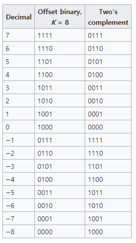

# toFixed 분석

toFixed를 사용하다가 예상치 못한 결과를 맞딱뜨렸다.

```jsx
console.log(100.15.toFixed(1)) // 100.2 (OK)
console.log(123.45.toFixed(1)) // 123.5 (OK)
console.log(50.65.toFixed(1)) // 50.6 (What??)
```

구글 서치 결과 stack overflow에서도 나와 같은 사람이 많았다. 여기서 해답을 얻고 더 궁금해져서 이것저것 찾아보다가 정리한 글을 소개한다.

글에서는 1. 원인이 무엇인지? 2. 왜 이렇게 했을까? 3. 해결 방법은 무엇인지? 4. 결론 순으로 진행한다.

# 원인이 무엇인가?

[TC39](https://tc39.es/ecma262/#sec-number.prototype.tofixed)에서 toFixed 명세서를 찾아봤다.

```jsx
1. Let x be ? thisNumberValue(this value).
2. Let f be ? ToIntegerOrInfinity(fractionDigits).
3. Assert: If fractionDigits is undefined, then f is 0.
4. If f is not finite, throw a RangeError exception.
5. If f < 0 or f > 100, throw a RangeError exception.
6. If x is not finite, return ! Number::toString(x).
7. Set x to ℝ(x).
8. Let s be the empty String.
9. If x < 0, then
a. Set s to "-".
b. Set x to -x.
10. If x ≥ 1021, then
a. Let m be ! ToString(𝔽(x)).
11. Else,
a. Let n be an integer for which n / 10^f - x is as close to zero as possible. If there are two such n, pick the larger n.
b. If n = 0, let m be the String "0". Otherwise, let m be the String value consisting of the digits of the decimal representation of n (in order, with no leading zeroes).
c. If f ≠ 0, then
i. Let k be the length of m.
ii. If k ≤ f, then
1. Let z be the String value consisting of f + 1 - k occurrences of the code unit 0x0030 (DIGIT ZERO).
2. Set m to the string-concatenation of z and m.
3. Set k to f + 1.
iii. Let a be the first k - f code units of m.
iv. Let b be the other f code units of m.
v. Set m to the string-concatenation of a, ".", and b.
12. Return the string-concatenation of s and m
```

알 수 없는 외계어(?) 같지만 천천히 읽어 보겠다. 추측하자면 1~11까지 사전 작업으로 보이고...

우리가 필요한 것은 11번째부터 이다.

```jsx
a. Let n be an integer for which n / 10^f - x is as close to zero as possible. 
If there are two such n, pick the larger n.
```

1. 해석하면 `int n`이 있고 이 값을 `n / 10^f - x` 식에 대입해 `0`에 가장 가깝게 만들어라
2. 만약 n이 2개 값이라면 가장 큰 n 값을 택하라

왜 이러한 알고리즘이 나왔는지는 아래에서 좀 더 구체적으로 알아보도록 하고 계속 이어가겠다.

TC39에 명세 되어있는 대로 하자면,  만약 아래와 같을 때

```jsx
50.65.toFixed(1) 
```

11.a에서 `x = 50.65; f = 1; int n`이 되고 n에 어떤 integer값을 넣었을 때 최대한 0에 가깝게 하라고 했으니

`n = 505`일 때 `-0.1499999`

`n = 506`일 때 `-0.049999...`

`n = 507`일 때 `0.050000...`

가 나오니 가장 가까운 값은 `n = 506`

다음으로

11.b에 따라 `n ≠ 0` 이므로 `m = '506'`이 됩니다.

3.iii에 따라 `a = '50'`

iv.에 따라 `b = '6'` 이 되고

v.에 따라 `m = '50.6`'이 되고

12번째에서 최종적으로 `'50.6'`이 반환 됩니다.

# 2. 왜 이러한 알고리즘일까?

간단 요약: 무한한 real number를 유한한 기계에서 표현해야 하기 때문에. 

32비트, 64비트에 따라 영역이 제한됨

메모리에 표시할 수 있는 한계가 있다. 

real number를 어떻게 표현할까?

# 잠깐 알아보자 컴퓨터의 부동 소수점 표현 방식

2진수로 이해한다.

10진수 ⇒ 2진수 변환과정

13, 13/2 ⇒ 6...1, 6/2 ⇒ 3 ...0, 3/2 ⇒ 1...1

 = 1101

0.75 , 0.75 * 2 ⇒ 1.50...1, 0.5 * 2 ⇒  

 = 0.11

263.3?

236 ⇒ 100000111

0.3 => 0.01001100110011......(0011)

Fixed Point

정수를 표현하는 비트 수와 소수를 표현하는 비트 수를 미리 정해 놓고 해당 비트 만큼만 표시

32bit에서 263.3은 (부호 1bit, 정수 16bit, 소수 15bit)

(0)0000000100000111.010011001100110

정수, 소수 표시 영역이 고정이라 정수가 커야 될 때 정수 영역에서만 표현가능, 큰 소수가 필요할 때 정해진 소수 영역 만큼만 표시 가능

Floating Point

IEEE 754 32bit에서 (부호 1bit, 지수 8bit, 가수 23bit)

263.3은

소수점을 맨 앞 1 뒤로 이동(이 때문에 부동 소수점이라 불린다.)

100000111.010011001100110... ⇒ 1.00000111010011001100110... * 2^8

2^8의 8을 지수라고 하고 하늘색 부분에 기록합니다. (IEEE 754 표현 방식에서는 127 + 지수를 기록합니다.)

소수점 이후 숫자 열 전체를 가수라고 하고 연두색 부분에 기록합니다.

sign bit= 0(양수)

8exp bit =10000111 (127(01111111) + 8(1000) = 135)

fraction bits = 00000111010011001100110

고정 소수점에 비교해서 더 정확해졌지만 0.3을 다 나타낼 수는 없다.

10진수로 나타내 보면 0.29998779296875을 나타냅니다.

bias를 더하는 이유? 2의 보수

컴퓨터 내부는 가산기(Adder)을 통해서 계산 뺄셈은 보수를 통해서 계산한다.

1의 보수: 주어진 비트를 반전 시킨 후 

1의 보수 뺼셈

주어진 비트를 반전 시킨 후 최상위 비트에서 자리올림이 생겼다면 최하위에 1을 더하고, 생기지 않았다면 연산결과에 1의 보수를 구한 후 - 부호를 붙인다.

111(7)

-110(6)

⇒ 111 + 001 ⇒ 1000 ⇒ 001 ⇒ 1

100(4) - 110(6)

⇒ 100 - 001 ⇒ 101 ⇒ 010 ⇒ 2

2의 보수: 1의 보수에 1을 더한다

2의 보수 뺄셈

0011(3)

1110(-2)

0001(1)

excess-k

k = 8일 때



참고: [https://en.wikipedia.org/wiki/Offset_binary](https://en.wikipedia.org/wiki/Offset_binary)

127?

지수는 (-, +값이 있는 부호 값)signed 값이 되어야함 -126~127

127을 더해주면 적절하게 저 범위를 유지할 수 있다.

[https://www.youtube.com/watch?v=vi5RXPBO-8E](https://www.youtube.com/watch?v=vi5RXPBO-8E)

64bit 일 때 bias = 1023

0.1 ⇒ 0011 1111 1111.00011001...

1.2 ⇒ 0100 0000 0000.001100...

10.3 ⇒ 0100 0000 0001.01001.... 

해당 비트 문자열을 부호없는 정수로 해석하고 해당 정수를 비교하여 해당 비트 문자열을 사 전적으로 또는 동등하게 비교가 쉽다 two complements에 비해서.

excess-8 표 보면 딱 와닿음

두 개의 실수를 계산해보자

소수점 계산 방법

```
  e=5;  s=1.234567
+ e=−3; s=9.876543
```

```
  e=5;  s=1.234567
+ e=5;  s=0.00000009876543 (after shifting)
----------------------
  e=5;  s=1.23456709876543 (true sum)
  e=5;  s=1.234567         (after rounding and normalization) // 32bit, 64bit냐에 따라 다르게 계산됨
```

# 부동 소수점 연산시 나타날수 있는 에러

소수점 연산시 나타날수 있는 에러 [https://en.wikipedia.org/wiki/Floating-point_arithmetic#Accuracy_problems](https://en.wikipedia.org/wiki/Floating-point_arithmetic#Accuracy_problems)

1. rounding error ⇒ 무한수를 유한수로 표현시 끝 수를 rounding
2. Catastrophic cancellation [https://en.wikipedia.org/wiki/Catastrophic_cancellation](https://en.wikipedia.org/wiki/Catastrophic_cancellation)
- 소거: 거의 같은 두 값을 빼는 것은 정확성을 매우 많이 잃게 된다. 이 문제가 아마도 가장 일반적이고 심각한 정확도 문제이다.
- 정수로의 변환 문제: (63.0/9.0)을 정수로 변환하면 7이 되지만 (0.63/0.09)는 6이 된다. 이는 일반적으로 반올림 대신 버림을 하기 때문이다.
- 제한된 지수부: 결과값이 오버플로되어 무한대값이 되거나 언더플로되어 [비정규 값](https://ko.wikipedia.org/wiki/%EB%B9%84%EC%A0%95%EA%B7%9C_%EA%B0%92) 또는 0이 될 수 있다. 만약 [비정규 값](https://ko.wikipedia.org/wiki/%EB%B9%84%EC%A0%95%EA%B7%9C_%EA%B0%92)이 되면 유효숫자를 완전히 잃어버린다.
- 나눗셈이 안전한지 검사하는데 문제가 생김: 제수(나눗수)가 0이 아님을 검사하는 것이 나눗셈이 오버플로되고 무한대값이 되지 않는 걸 보장하지 않는다.
- 같음을 검사하는데 문제가 생김: 수학적으로 같은 계산결과가 나오는 두 계산 순서가 다른 부동소수점 값을 만들어낼 수 있다. 프로그래머는 어느정도의 허용 오차를 가지고 비교를 수행하지만, 그렇다고 해서 문제가 완전히 없어지지 않는다.

**IEEE 754에서 위와 같은 문제를 다루면서 부동 소수점을 표현할 수 있도록 표준화 했다.**

구체적으로는 모르겠지만 소수점 표현 방식 때문에 소수점은 tie-breaking 규칙이 필요하다 2개가 나올 때 하나 선택해 됨

*JS 뿐만아니라 Python3의 경우도 같은 결과를 내놓습니다.

print(round(50.65, 1)) // 50.6

[https://www.programiz.com/python-programming/online-compiler/](https://www.programiz.com/python-programming/online-compiler/)

# 해결 방법

하지만 우리는 50.65가 50.7이되게 하고싶은데 어떻게 해야될까요?

[https://stackoverflow.com/questions/11832914/how-to-round-to-at-most-2-decimal-places-if-necessary/12830454#12830454](https://stackoverflow.com/questions/11832914/how-to-round-to-at-most-2-decimal-places-if-necessary/12830454#12830454)

```jsx
function round(num, decimalPlaces = 0) {
    var p = Math.pow(10, decimalPlaces);
    var m = Number((Math.abs(num) * p).toPrecision(15));
    return Math.round(m) / p * Math.sign(num);
}

round(50.65, 1) // 50.7
```

2가지의 라이브러리가 있습니다.

js에서 대한 lodash의 round(js에서 해결방법 제공하기)

lodash 음수 반올림이 다름

decimal.js

[https://mikemcl.github.io/decimal.js/](https://mikemcl.github.io/decimal.js/)

[https://en.wikipedia.org/wiki/Rounding#Round_half_away_from_zero](https://en.wikipedia.org/wiki/Rounding#Round_half_away_from_zero)

# 결론

(chrome 소스 코드 까본것은 언급만하자)

chrome 코드를 살펴본 결과 grisu3 알고리즘 등과 같이 float을 어떻게 보여줄 것 인가에 대한 코드가 많음 결과적으로 주어진 값의 크기에 따라 특정한 알고리즘을 적용하여 구현했다. 성능을 지키면서 정확도를 지키기위한 것으로 보임

추가적으로 정수를 string으로 변환할때 toString보다는 toFixed가 정확하다.

```
(1000000000000000128).toString() // **"1000000000000000100"**
(1000000000000000128).toFixed(0) // **"1000000000000000128"**
```

# 도움을 주신 분들

---

불필요한 부분(?)

# 어떠한 원리로 되어있길래? (HOW)

# ? (ReturnIfAbrupt)

> 1. Let hygienicTemp be AbstractOperation().
2. If hygienicTemp is an abrupt completion, return hygienicTemp.
3. Else if hygienicTemp is a Completion Record, set hygienicTemp to hygienicTemp.[[Value]].

hygienicTemp ⇒ 변수로 이해hygienicTemp ⇒ 변수로 이해

1. 어떤 변수에 함수를 담는다.
2. 변수가 abrupt completion(갑작스런 완료)라면, 매개변수를 반환한다.
3. 만약 변수가 Completion Record라면 변수를  어떤 ECMAScript Language Types 또는 빈 값의만약 변수가 Completion Record라면 변수를  어떤 ECMAScript Language Types 또는 빈 값의 변수로 설정한다(?) 

[[Value]]: [https://tc39.es/ecma262/#sec-property-attributes](https://tc39.es/ecma262/#sec-property-attributes)

대략 어떤 작업을 시작하거나 변수를 반환한다.

# Abrupt completion

The term “abrupt completion” refers to any completion with a [[Type]] value other than normal.

```cpp
Handle<Object> value = args.at(0);
  Handle<Object> fraction_digits = args.atOrUndefined(isolate, 1);

  // Unwrap the receiver {value}.
  if (value->IsJSPrimitiveWrapper()) {
    value = handle(Handle<JSPrimitiveWrapper>::cast(value)->value(), isolate);
  }
  if (!value->IsNumber()) {
    THROW_NEW_ERROR_RETURN_FAILURE(
        isolate, NewTypeError(MessageTemplate::kNotGeneric,
                              isolate->factory()->NewStringFromAsciiChecked(
                                  "Number.prototype.toFixed"),
                              isolate->factory()->Number_string()));
  }
  double const value_number = value->Number();
```

대략 AbstractOperation()이 true면 계속 진행하고  throw, return 등 하라는 소리

# Completion Record

데이터 전파와 제어 흐름을 설명할 때 쓰이는 테이블 

[https://tc39.es/ecma262/#sec-completion-record-specification-type](https://tc39.es/ecma262/#sec-completion-record-specification-type)

# !

Similarly, prefix **`!`** is used to indicate that the following invocation of an abstract or syntax-directed operation will never return an [abrupt completion](https://tc39.es/ecma262/#sec-completion-record-specification-type) and that the resulting [Completion Record](https://tc39.es/ecma262/#sec-completion-record-specification-type)'s [[Value]] field should be used in place of the return value of the operation. For example, the step:

1. 1. Let val be ! OperationName().

is equivalent to the following steps:

1. 1. Let val be OperationName().
2. 2. [Assert](https://tc39.es/ecma262/#assert): val is never an [abrupt completion](https://tc39.es/ecma262/#sec-completion-record-specification-type).
3. 3. If val is a [Completion Record](https://tc39.es/ecma262/#sec-completion-record-specification-type), set val to val.[[Value]].

Syntax-directed operations for [runtime semantics](https://tc39.es/ecma262/#sec-runtime-semantics) make use of this shorthand by placing **`!`** or **`?`** before the invocation of the operation:

1. 1. Perform ! SyntaxDirectedOperation of *NonTerminal*.

어떤 조건에 맞을 때만 실행하고 아니라면 변수를 반환하라

코드 발췌

```cpp
if (std::isinf(value_number)) {
    return (value_number < 0.0) ? ReadOnlyRoots(isolate).minus_Infinity_string()
                                : ReadOnlyRoots(isolate).Infinity_string();
  }
```

# V8, toFixed 구현

[https://github.com/v8/v8/blob/dc712da548c7fb433caed56af9a021d964952728/src/builtins/builtins-number.cc](https://github.com/v8/v8/blob/dc712da548c7fb433caed56af9a021d964952728/src/builtins/builtins-number.cc)

# Why?

```jsx
a. Let n be an integer for which n / 10f - x is as close to zero as possible.
```

위의 문구를 어떻게 구현했는지 모르겠음, but

살펴본 결과 grisu3 알고리즘 등과 같이 float을 어떻게 보여줄 것 인가에 대한 코드가 많음

결과적으로 성능을 위해 정확도를 포기한 것으로 보이고

참고: [https://stackoverflow.com/questions/11832914/how-to-round-to-at-most-2-decimal-places-if-necessary/12830454#12830454](https://stackoverflow.com/questions/11832914/how-to-round-to-at-most-2-decimal-places-if-necessary/12830454#12830454)

[https://stackoverflow.com/questions/66742034/tofixed-rounds-at-6-why-not-5](https://stackoverflow.com/questions/66742034/tofixed-rounds-at-6-why-not-5)

[https://ko.wikipedia.org/wiki/부동소수점](https://ko.wikipedia.org/wiki/%EB%B6%80%EB%8F%99%EC%86%8C%EC%88%98%EC%A0%90)

[https://tc39.es/ecma262/#sec-number.prototype.tofixed](https://tc39.es/ecma262/#sec-number.prototype.tofixed)

[https://en.wikipedia.org/wiki/Floating-point_arithmetic#Accuracy_problems](https://en.wikipedia.org/wiki/Floating-point_arithmetic#Accuracy_problems)

[https://en.wikipedia.org/wiki/Catastrophic_cancellation](https://en.wikipedia.org/wiki/Catastrophic_cancellation)

[https://en.wikipedia.org/wiki/Rounding#Round_half_away_from_zero](https://en.wikipedia.org/wiki/Rounding#Round_half_away_from_zero)

[https://steemit.com/kr/@modolee/floating-point](https://steemit.com/kr/@modolee/floating-point)

[https://www.youtube.com/watch?v=8afbTaA-gOQ](https://www.youtube.com/watch?v=8afbTaA-gOQ)

[https://ko.wikipedia.org/wiki/IEEE_754](https://ko.wikipedia.org/wiki/IEEE_754)

[https://corona-world.tistory.com/18](https://corona-world.tistory.com/18)

[https://stackoverflow.com/questions/19864749/why-do-we-bias-the-exponent-of-a-floating-point-number/67089215#67089215](https://stackoverflow.com/questions/19864749/why-do-we-bias-the-exponent-of-a-floating-point-number/67089215#67089215)