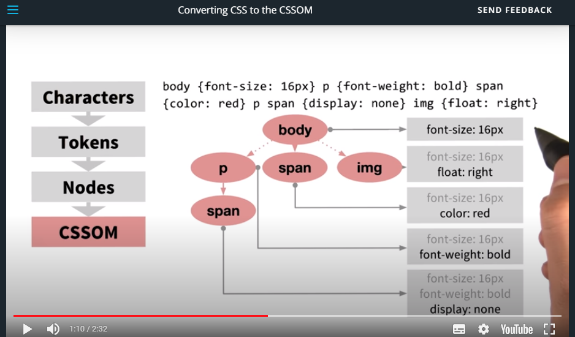
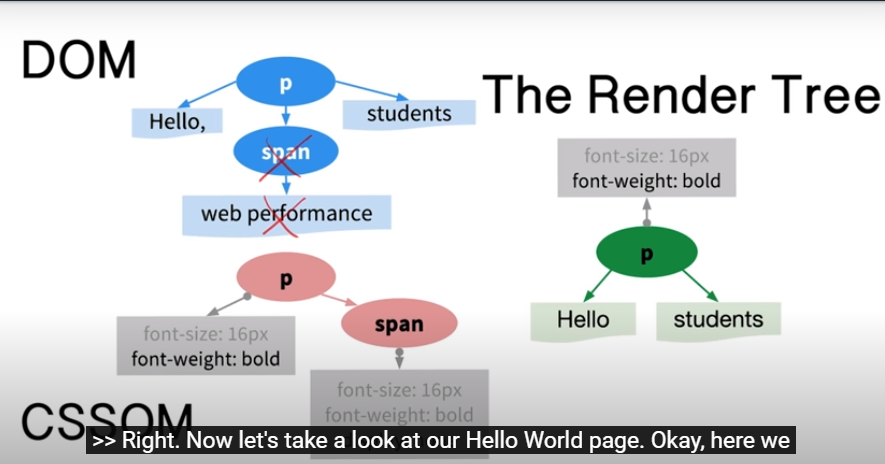
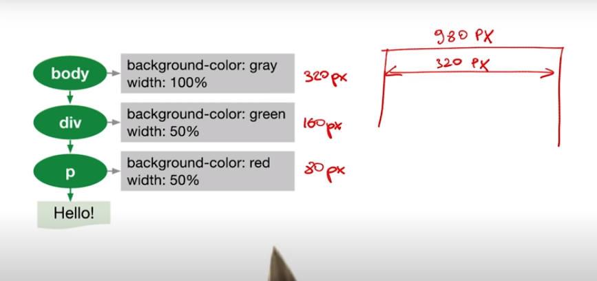
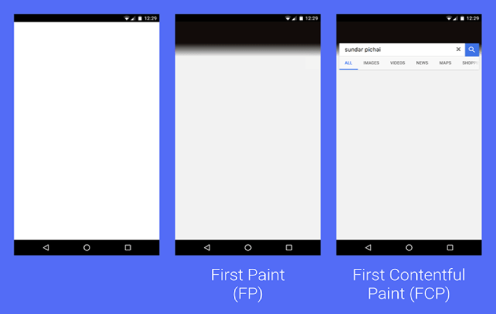

1. Udacity의 Website Performance Optimization를 읽고 정리
2. 주어진 과제 최적화
3. webpack등 활용해 더 최적화 해보기

# 웹 성능 최적화 기초
## CRP(Critical Rendering Path)란?
브라우저가 HTML, CSS, JS를 읽고 픽셀로 표현되는 일련의 과정

먼저 브라우저가 HTML 파일을 읽으면 아래와 같은 과정이 진행된다.
## 1. Parse HTML

브라우저는 DOM을 생성한다.

만약 아래와 같은 HTML이 있다면 
```html
<!DOCTYPE html>
<html>
  <head>
    <meta name="viewport" content="width=device-width,initial-scale=1">
    <link href="style.css" rel="stylesheet">
    <script src="app.js"></script>
    <title>Critical Path</title>
  </head>
  <body>
    <p>Hello <span>web performance</span> students!</p>
    <div></div>
  </body>
</html>
```

1. 먼저 네트워크 통신 데이터를 읽는다.
2. 문자열로 변환한다.
3. 트리형 구조를 담을 수 있는 토큰으로 변환한다.
4. DOM에 필요한 데이터가 담겨있는 Node로 변환한다. 전문용어로 렉싱(lexing)이라 한다.
5. Tree 형태의 DOM 구조를 만든다.


DOM 구조를 만들면서

link 또는 script tag를 만나면 각각의 파일을 네트워크 통신으로 가져온다. 

이후에 구체적으로 설명할 내용이지만 js는 parser blocking이다. 즉, HTML parse가 진행되다가 js를 읽는 순간 CSSOM(이후에 설명)이 생성되기까지 HTML parse 과정을 잠시 멈춘다. 
```html
<html>
 <head></head>
 <body>
   <p>
   <span>Hello</span>
   <!-- script를 만나면 HTML parse를 잠시 중단한다.  -->
   <script>
     // 여기서 Hello span을 가져와서 어떤 작업을 수행이 가능하다...
     // 하지만 World div를 가져와서 어떤 작업을 수행할 수 없다. null이 오기 때문
   </script>
   <div>World</div>
   </p>
 </body>
</html>
```

이 때에 만약 script를 2개 이상 불러온다면 첫 script를 읽고 데이터를 가져오고 js가 실행된 후 그 다음 script 데이터를 가져오고 js를 실행하게 된다. 이렇게 되면 대기 시간이 너무 길어지게 되기때문에 브라우저는 Preload Scanner을 사용한다.

js가 실행되기까지 parser blocking이 되는 중이라도 Preload Scanner가 다음 줄을 계속해서 읽으며 script, style, 이미지 등의 데이터를 네트워크 통신으로 가져온다. 이때 최소 라운드 트립은 1회이다.

특정한 상황에서만 link를 통해 style을 불러올 수 도있다. 바로 media query를 쓰는 것이다.
```html
<!-- 인쇄가 이뤄질 때 style을 가져온다. -->
<link rel="stylesheet" href="style-print.css" media="print">
```

## Recalculate Style

CSS가 주어지면 브라우저는 CSSOM을 생성한다.

만약 아래와 같은 CSS가 있다면
### style.css
```css
body { font-size: 16px }
p { font-weight: bold }
span { color: red }
p span { display: none }
img { float: right }
```

1. 네트워크  통신 데이터를 읽는다.
2. 문자열로 변환한다.
3. 트리형 구조를 담을 수 있는 토큰으로 변환한다.
4. Node로 변환한다.
5. CSSOM 구조를 만든다.



## JS
js는 DOM과 CSSOM을 조작가능하다. Parser blocking이다.

Parser blocking 해결방법
1. body아래에 script tag를 놓는다.
1. defer 속성: 스크립트 다운로드가 HTML parsing에 방해되지  않는다, JS 실행은 페이지 구성이 끝날 때까지 지연된다.
1. async 속성: defer와 비슷하지만, 스크립트 다운로드가 끝나면 바로 실행된다.
1. window.onload 를 사용한다.

## 6. Render Tree(DOM과 CSSOM 병합하기)

이제 생성된 DOM과 CSSOM을 병합한다.

브라우저는 CSSOM이 만들어져야 다음과정을 진행할 수 있으므로 CSS는 Render blocking이다.



한 가지 알면 좋은 것은 visibility 속성에 비해 display는 병합하는 과정에서 CSSOM의 `display: none`을 만나면 아예 무시하고 진행하기 때문에 성능 최적화가 이뤄진다.

## Layout (Reflow)
엘리먼트가 어떻게 위치할 것인지 결정한다.



Note: body 태그의 width는 viewport 기준이다. <meta/>에 적힌 값

batch 형식으로 진행하는 것이 layout을 여러번 실행시키지 않으므로 성능상 도움이 된다.

## Paint (Repaint)
layer에 픽셀화를 진행한다. Paint는 여러 layer에 나눠서 진행될 수 도 있다. [참고](https://sculove.github.io/slides/improveBrowserRendering/#/6)

## Composite Layers
여러 layer에서 그린 것을 하나로 합친다.

# 용어 정리
## 1. FP(First Paint)
첫 픽셀이 그려지는 시점

(https://newrelic.com/blog/how-to-relic/browser-first-paint-first-contentful-paint)
## 1. L(onload Event)
각 페이지 로드의 최종 단계로, 브라우저가 추가 애플리케이션 로직을 트리거할 수 있는 onload 이벤트를 발생시킵니다.
## 1. DCL(DOMContentLoaded Event)
DOM이 준비되고 자바스크립트 실행을 차단하는 스타일시트가 없는 시점을 표시합니다. 즉, 이제 (잠재적으로) 렌더링 트리를 생성할 수 있습니다.

## 1. FCP(First Contentful Patint)
페이지가 로딩을 시작해서 어떤 콘텐츠(텍스트, 이미지, svg, canvas, 등)가 화면에 보이기 시작할 때를 가리킴
## 1. LCP(Largest Contentful Paint)
가장 사이즈가 큰 컨텐츠가 렌더링 되는 시간(img, svg, video, url(). text nodes)

사이즈는 용량이 아닌 viewport에 보여지는 고유 너비, 높이(maring, padding은 포함되지 않음)

LCP가 가장 중요한 컨텐츠는 아니다.

## 1. FID(First Input Delay)
유저가 처음 페이지와 인터렉션 하고 응답이 오는 시간

예: 링크 클릭, 단 줌인아웃, 스크롤링을 판별대상이 아님

이벤트 리스너가 붙지 않아도 측정된다.

대상: ```<input>, <textarea>, <select>, <a>, etc```

왜 신경써야 하는가? => 유저의 첫 인상을 결정짓는다.

## 1. TTI(Time to Interactive)
페이지가 완전히 상호작용(interactive) 가능하기까지 얼마나 걸리는지 측정

페이지가 완전히 상호작용 가능한지 다음의 방법으로 안다.
1. FCP가 존재하고
2. 페이지의 보이는 부분에 이벤트 헨들러가 등록됐고
3. 페이지가 유저 인터렉션에 50ms 안에 반응할 때 

## 1. TBT(Total Blocking Time)
FCP에서 TTI까지 main thread가 입력 응답에 얼마나 시간이 걸렸는지 측정
## 1. TTFB(Time to First Byte)
서버에 데이터 응답을 요청하고 다운받기까지 걸린시간


## 1. Long task
50ms 보다 큰 작업을 말함

## 성능 최적화 방법

## Chrome dev tools으로 성능 최적화하기
https://developer.chrome.com/docs/devtools/evaluate-performance/reference/

https://developer.chrome.com/docs/devtools/evaluate-performance/performance-reference/

## 실제 앱 최적화하기
https://developers.google.com/web/fundamentals/performance/get-started/wrapup-7

https://developer.chrome.com/docs/devtools/speed/get-started/
