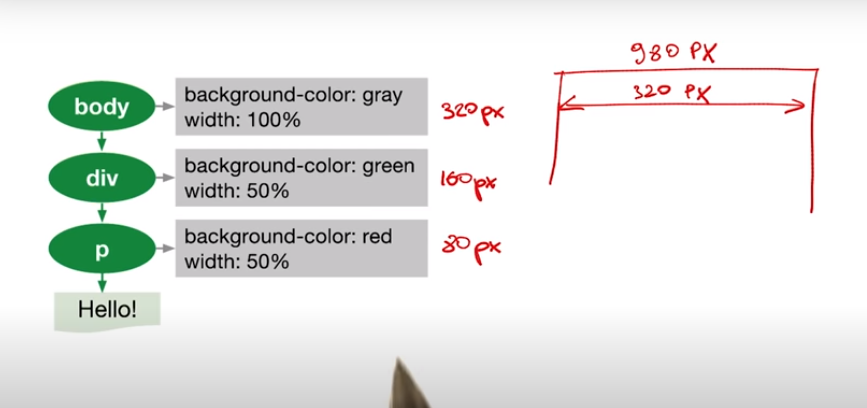

1. Udacity의 Website Performance Optimization를 읽고 정리
2. 주어진 과제 최적화
3. webpack등 활용해 더 최적화 해보기

CRP(Critical Rendering Path)란?
브라우저가 HTML, CSS, JS를 읽고 픽셀로 표현되는 일련의 과정


## 1. Parse HTML

브라우저는 DOM을 생성한다.

만약 아래와 같은 HTML이 있다면 
```html
<!DOCTYPE html>
<html>
  <head>
    <meta name="viewport" content="width=device-width,initial-scale=1">
    <link href="style.css" rel="stylesheet">
    <script src="app.js"></script>
    <title>Critical Path</title>
  </head>
  <body>
    <p>Hello <span>web performance</span> students!</p>
    <div></div>
  </body>
</html>
```

1. 먼저 네트워크 통신 데이터를 읽는다.
2. 문자열로 변환한다.
3. 트리형 구조를 담을 수 있는 토큰으로 변환한다.
4. DOM에 필요한 데이터가 담겨있는 Node로 변환한다. 전문용어로 렉싱(lexing)이라 한다.
5. Tree 형태의 DOM 구조를 만든다.


DOM 구조를 만들면서

link 또는 script tag를 만나면 각각의 파일을 네트워크 통신으로 가져온다. 

이후에 구체적으로 설명할 내용이지만 js는 parser blocking이다. 즉, HTML parse가 진행되다가 js를 읽는 순간 js가 실행되기 까지 HTML parse 과정을 잠시 멈춘다. 

이 때에 만약 script를 2개 이상 불러온다면 첫 script를 읽고 데이터를 가져오고 js가 실행된 후 그 다음 script 데이터를 가져오고 js를 실행하게 된다. 이렇게 되면 대기 시간이 너무 길어지게 되기때문에 브라우저는 Preload Scanner을 사용한다.

js가 실행되기까지 parser blocking이 되는 중이라도 Preload Scanner가 다음 줄을 계속해서 읽으며 script, style, 이미지 등의 데이터를 네트워크 통신으로 가져온다.

그렇기 때문에 각각의 데이터를 한번에 전부 가져온다. 즉, 한번의 라운드 트립으로 가져온다.

특정한 상황에서만 link를 통해 style을 불러올 수 도있다. 바로 media query를 쓰는 것이다.
```html
// 인쇄가 이뤄질 때 style을 가져온다.
<link rel="stylesheet" href="style-print.css" media="print">
```

## Recalculate Style

CSS가 주어지면 브라우저는 CSSOM을 생성한다.

만약 아래와 같은 CSS가 있다면
### style.css
```css
body { font-size: 16px }
p { font-weight: bold }
span { color: red }
p span { display: none }
img { float: right }
```

1. 네트워크  통신 데이터를 읽는다.
2. 문자열로 변환한다.
3. 트리형 구조를 담을 수 있는 토큰으로 변환한다.
4. Node로 변환한다.
5. CSSOM 구조를 만든다.


### 6. Render Tree(DOM과 CSSOM 병합하기)

이제 생성된 DOM과 CSSOM을 병합한다.

브라우저는 CSSOM이 만들어져야 다음과정을 진행할 수 있으므로 CSS는 Render blocking이다.


한 가지 알면 좋은 것은 visibility 속성에 비해 display는 병합하는 과정에서 CSSOM의 `display: none`을 만나면 아예 무시하고 진행하기 때문에 성능 최적화가 이뤄진다.

## Layout (Reflow)
엘리먼트가 어떻게 위치할 것인지 결정한다.



Note: body 태그의 width는 viewport 기준이다. <meta/>에 적힌 값

batch 형식으로 진행하는 것이 layout을 여러번 실행시키지 않으므로 성능상 도움이 된다.

## Paint (Repaint)
layer에 픽셀화를 진행한다. Paint는 여러 layer에 나눠서 진행될 수 도 있다. [참고](https://sculove.github.io/slides/improveBrowserRendering/#/6)

## Composite Layers
여러 layer에서 그린 것을 하나로 합친다.