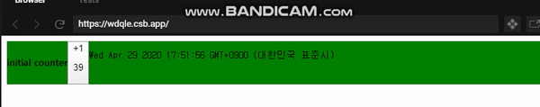

# Redux Persist를 소개합니다.

**Reducer의 State값을 Web storage(이하 Storage라 지칭)에 저장/관리합니다.**

흔히 여러 컴포넌트를 거치지 않고 손쉽게 State를 전달하기 위해 혹은 분리해서 중앙화하기 위해 Redux를 사용합니다.

하지만 Redux에 저장된 데이터는 새로 고침 버튼을 누르거나 종료하는 순간 날아가 버리고 맙니다. 
날아가는 것을 방지하기 위해서 흔히 데이터를 Javascript Web Storage API를 통해 Storage에 저장하는데요. 

Redux Persist의 ```persistReducer```를 특정 Reducer와 결합해주기만 하면 Storage에서 저장된 값을 가져옵니다. 여기서 만약 저장된 데이터가 없다면 Storage에 저장하는 rehydrate(재수화) 과정을 거칩니다.

Redux Persist는 어떤 면에서는 미들웨어와 비슷한 역할을 합니다.

 Reducer의 State 값을 get/set을 하기 전 Reducer의 특정 State만 저장을 하게 할 수 있고 암호/복호화를 할 수 도 있으니까요. 
 
 참고로 이후에 설명해 드릴 ```PURGE``` 액션을 호출할 때를 제외하고 Storage에서 데이터를 delete를 하지 않습니다. 그 대신 State Reconsiler라는 기능을 제공해 기존에 Storage에 저장된 오브젝트와 Application에서 오는 오브젝트가 어떻게 병합될 것인지 결정할 수 있죠. 

# 목차
아래의 3가지로 항목을 나눠 진행하겠습니다.
1. Counter 예제에 Redux Persist 입히기 
       
   (독자분들은 어느정도 React.js를 안다고 가정하고 예제는 따로 설명치 않겠습니다.)

2. 마법같은 Redux Persist를 deep하게 알아보기
 
   Redux Persist의 코드를 살펴보며 작동원리를 알아보겠습니다.

3. 여러 기능
   
   Redux Persist에서 제공하는 여러 기능에 대해서 알아보겠습니다.


# 1. Counter 예제에 Redux Persist 입히기

Counter 예제:

[](https://codesandbox.io/s/counter-mdlqq?fontsize=14&hidenavigation=1&theme=dark)


[```counterPersistConfig```](https://github.com/rt2zz/redux-persist/blob/master/src/types.js#L13-L30)를 만들어서 ```persistReducer```의 첫 번째 인자로 넣어줍니다.


그리고 Counter 예제에 이미 구현된 ```counterReducer```를 ```persistReducer```의 두 번째 인자로 넣어줍니다.


index.js
---
```js
const counterPersistConfig = {
  key: "counter",
  storage: storage
};

const rootReducer = combineReducers({
  counterReducer: persistReducer(counterPersistConfig, counterReducer)
});
```

Persist Store을 생성해줍니다.
```js
const store = createStore(rootReducer);
const persistor = persistStore(store);
```

Provider를 연결해줍니다.
```js
ReactDOM.render(
  <Provider store={store}>
    <PersistGate loading={<Loading />} persistor={persistor}>
      <App />
    </PersistGate>
  </Provider>,
  document.getElementById("root")
```
완료했습니다! 간단하죠?

이제 새로고침해도 초기화 되지 않는것을 확인할 수 있습니다. 




완성본: 

[](https://codesandbox.io/s/redux-persist-counter-wdqle?fontsize=14&hidenavigation=1&theme=dark)

우리가 해야할 것을 정리하면 이렇습니다.
1. 원하는 Reducer에 ```persistReducer``` 감싸주기
2. Persist Store 만들기
3. Persist Provider 연결하기

</br>

# 2. 마법같은 Redux Persist를 Deep하게 알아보기

연결만 해주면 알아서 State 값을 저장하는 게 저에게는 마치 마법과 같았습니다. 

실제 코드를 뜯어보며 마법이 이뤄지는 원리를 알아보겠습니다.

</br>

다시 한번 위의 Counter 예제 완성본을 보고 어떤 일이 일어나는지 보겠습니다.


1. 콘솔 창에 ```loading...```이 나타납니다.
2. F12를 눌러 Redux Dev Console을 확인하면 ```persistReducer```가 감싸진 각각의 Reducer들은 ```REHYDRATE``` 액션이 호출됩니다.
3. F12를 눌러 DevTools에서 Application > Storage > Local Storage 항목을 확인하면 각 Reducer의 State 값이 저장된 것을 확인할 수 있습니다. 

위의 결과를 토대로 질문하고 답하는 Q/A 형식으로 진행하겠습니다.

</br>

# Q) 2.1. ```<PersistGate/>```의 역할은 무엇인가요?

 
```<PersistGate/>```의 ```state.bootstraped = false``` 이므로 아래의 코드 처럼 props로 전달받은 Loading 컴포넌트를 보여줍니다. 

[react.js](https://github.com/rt2zz/redux-persist/blob/d7efde9115a0bd2d6a0309ac6fb1c018bf06dc30/src/integration/react.js#L64)
---
```js
  render() {
    //...
    return this.state.bootstrapped ? this.props.children : this.props.loading
  }
```

이전에 ```persistConfig``` 오브젝트에 넣은 key 값이 기억나시나요? 

1. Redux Persist에서 ```config.key``` 값 별로 Reducer를 등록합니다.

    다른 Redux Store인 ```_pStore``` 의 ```registry: []```라는 State에 key 값을 저장하는 등록(Register) 과정을 거칩니다. 

2. 아래에 함수에서 이미 Storage에 저장된 값이 있다면 그 값을 get합니다.

    ```getStoredState(config)```


3. 그 후에 아래의 함수에서 특정 Reducer의 State를 Storage에 저장하는 **재수화** 과정을 거칩니다. 재수화가 완료되면 ```registry```에서 해당 Reducer를 제거하고 나머지도 계속 진행합니다.

    ``` writeStagedState()```


4. ```registry```가 빈 배열이 되면  ```_pStore```에 저장된 또다른 state인 ```bootstrapped: boolean```의 값이 ```true```가 되면 ```<PersistGate/>```의 ```bootstrapped``` State 값을 바꿔 로딩을 해제합니다.

정리하면 모든 Reducer의 재수화가 완료됐는지 여부를 알 수 있습니다.

</br>

# Q) 2.2. ```REHYDRATE```(재수화) 액션은 어디서부터 개시되나요? (+구조 알아보기)

이전에 Counter 예제에서 ```persistReducer()```가 있는 것을 볼 수 있습니다. 
```js
const rootReducer = combineReducers({
  counterReducer: persistReducer(counterPersistConfig, counterReducer)
});
```

```persistReducer```에 첫번째 인자로 Config 값을 넣어주고 두 번째로 Reducer를 넣어줍니다. 

코드를 한번 뜯어볼까요?

persisReducer.js
---

```ts
// 아래는 persistReducer 코드의 일부분입니다.
export default function persistReducer<State: Object, Action: Object>(
  config: PersistConfig, // 첫 번째 인자는 config
  baseReducer: (State, Action) => State // 두 번째인자는 Reducer입니다.
): (State, Action) => State & PersistPartial {
//...
  return (state: State, action: Action) => {
    //...
    
    // 여기서 어떤 액션이 오면 PERSIST 액션을 탐지하면 특정 기능을 수행하고 두 번째 인자로 들어온 Reducer를 반환합니다.
    // 나머지 액션도 비슷합니다.
    if (action.type === PERSIST) {
      return {
        ...baseReducer(restState, action),
        _persist: { version, rehydrated: false },
      }
    } else if (action.type === PURGE) {
      //...
      return {
        ...baseReducer(restState, action),
        _persist,
      }
    } else if (action.type === FLUSH) {
      //...
      return {
        ...baseReducer(restState, action),
        _persist,
      }
    } else if (action.type === PAUSE) {
      //...
    } else if (action.type === REHYDRATE) {
    //...
    }
```

아하! ```persistReducer```는 Reducer에 이미 존재하는 액션 외에 다른 액션: PERSIST, PURGE, FLUSH, PAUSE, REHYDRATE을 추가적으로 탐지해 특정 기능을 수행하는 기능을 붙여주는군요.

그 다음으로 ```persistStore()```를 알아보겠습니다.

Counter 예제에서 아래의 방법으로 호출되었죠?
```js
const store = createStore(rootReducer);
const persistor = persistStore(store);
```

```persistStore()```의 코드를 뜯어보면 코드의 밑 부분에서 아래의 명령문을 발견할 수 있습니다.

persistStore.js
---
```js
  if (!(options && options.manualPersist)){
    persistor.persist()
  }
```


 ```persistStore.persist()``` 함수를 뜯어보면 아래와 같은 명령문으로 이뤄졌네요.


```js
    persist: () => {
      store.dispatch({ type: PERSIST, register, rehydrate })
    },
```

아하! 여기서 ```PERSIST``` 액션을 호출해주고 호출되면서 시작되는군요! 해당 액션이 호출되면 이전에 언급했던 등록(register) 과정도 있고

이미 저장된 데이터가 있을 때 Storage에서 가져오는 과정도 있고 재수화해주는 과정도 있습니다.

persistReducer.js
---
```js
if (action.type === PERSIST) {
  //...

  action.register(config.key)

  getStoredState(config).then(
        restoredState => {
          //...
              _rehydrate(migratedState)
```

```_rehydrate(migratedState)``` 함수가 호출되면 ```REHYDRATE``` 액션도 호출됩니다. 

```REHYDRATE``` 액션이 발동될 때 어떤 로직이 실행되는지 아래의 코드로 보겠습니다.

```js
    } else if (action.type === REHYDRATE) {
      // noop on restState if purging
      if (_purge)
        return {
          ...restState,
          _persist: { ..._persist, rehydrated: true },
        }

      // @NOTE if key does not match, will continue to default else below
      if (action.key === config.key) {
        let reducedState = baseReducer(restState, action)
        let inboundState = action.payload
        // only reconcile state if stateReconciler and inboundState are both defined
        let reconciledRest: State =
          stateReconciler !== false && inboundState !== undefined
            ? stateReconciler(inboundState, state, reducedState, config)
            : reducedState

        let newState = {
          ...reconciledRest,
          _persist: { ..._persist, rehydrated: true },
        }
        return conditionalUpdate(newState)
      }
```

재수화 과정에 ```conditionalUpdate```(blacklist, whitelist), State Reconciler의 과정이 있다는 것을 볼 수 있습니다. 

이 기능들이 어떤 기능인지 다음 섹션에서 알아보겠습니다.

</br>

# 3. 여러 기능

Redux Persist에는 여러가지 기능이 있습니다.

 그 중 3가지 Purge, Blacklist & Whitelist, State Reconciler을 알아보겠습니다.

</br>

# 3.1. Purge
                                      
Storage에 저장된 데이터를 **삭제**하고 다른 값으로 초기화 할 수 있습니다.

</br>


Counter 예제에서 이 부분이 기억나시나요?
```js
const store = createStore(rootReducer);
const persistor = persistStore(store);
```

```persistStore(store);```에서 반환되는 ```persistor``` 오브젝트의 코드를 보면 이렇습니다.
```js
  let persistor: Persistor = {
    ..._pStore,
    purge: () => {
      let results = []
      store.dispatch({
        type: PURGE,
        result: purgeResult => {
          results.push(purgeResult)
        },
      })
      return Promise.all(results)
    },
    flush: () => {
      let results = []
      store.dispatch({
        type: FLUSH,
        result: flushResult => {
          results.push(flushResult)
        },
      })
      return Promise.all(results)
    },
    pause: () => {
      store.dispatch({
        type: PAUSE,
      })
    },
    persist: () => {
      store.dispatch({ type: PERSIST, register, rehydrate })
    },
  }
```

간단히 특정 액션을 dispatch 해주는 것 밖에없습니다. 그러면 해당 액션은 ```persistReducer```에서 ```purgeStoredState()```를 호출해 처리해줍니다.

```js
export default function purgeStoredState(config: PersistConfig) {
  const storage = config.storage
  const storageKey = `${
    config.keyPrefix !== undefined ? config.keyPrefix : KEY_PREFIX
  }${config.key}`
  return storage.removeItem(storageKey, warnIfRemoveError)
}
```

이제 적용 예제를 보겠습니다.


1.원하는 부분에 purge()함수를 호출합니다.
```ts
import { persistor } from "../../stores";

  // 로그인이 성공할 때 호출되는 함수
  async onLoginSuccess(auth) {
    auth.isAuthenticated = true;
    this.props.setAuth(auth);
    // redux-persist에 의해 local storage에 저장된 모든 데이터 초기화
    // PURGE 액션이 호출됩니다.
    await persistor.purge();

    this.moveNextPage();
  }
```

2.초기화를 원하는 Reducer에 PURGE 액션을 구현합니다.

```ts
import { PURGE } from "redux-persist";

// 새로운 오브젝트를 생성합니다.
const initState = () => { item: [] }
export const itemReducer = (state = initState(), action) => {
  switch (action.type) {
    case PURGE: {
      // Storage에 저장된 데이터가 삭제 된 후 오브젝트가 초기화 됩니다.
      return initState();
    }

    case SET_ITEM: {
      return {
        ...state,
        item: action.payload.item
      };
    }

    default: {
      // render가 발생하지 않도록 오브젝트 그대로 반환합니다.
      return state;
    }
  }
};
```

이제 ```onLoginSuccess``` 함수가 호출될 때마다 Storage에 저장된 ```itemReducer```의 state 값이 초기화 됩니다. 

간혹, Storage가 비워지지 않는 경우가 있습니다. 

예를 들어 여러번의 ```REHYDRATE``` 액션이 호출될 때 ```PURGE``` 액션 또한 호출할 경우 입니다. 

이 경우 Race Condition이 발생해 비워지지 않을 수 있습니다.

</br>

# 3.2. Blacklist, Whitelist를 사용해 특정 값 저장되지 않게 하기/특정 값만 허용하기

Blacklist는 배열에 Redux안의 State 이름을 적어주면 해당 데이터가 Storage에 저장되는 것을 막을 수 있습니다. 

Whitelist는 똑같이 적어주면 해당 데이터만 Storage에 저장되도록 합니다.
```js
// BLACKLIST
const persistConfig = {
  key: 'root',
  storage: storage,
  blacklist: ['navigation'] // navigation will not be persisted
};

// WHITELIST
const persistConfig = {
  key: 'root',
  storage: storage,
  whitelist: ['navigation'] // only navigation will be persisted
};
```


코드를 뜯어보겠습니다.

REHYDRATE 액션이 실행되면 ```conditionalUpdate(newState)``` 이 함수가 실행됩니다.

이 함수의 코드를 보면
```js
  const conditionalUpdate = state => {
    // update the persistoid only if we are rehydrated and not paused
    state._persist.rehydrated &&
      _persistoid &&
      !_paused &&
      _persistoid.update(state)
    return state
  }
```
위와 같이 되어있습니다.

```_persistoid.update(state)``` 함수의 코드를 따라가면 아래처럼 되어있고

```js
 const update = (state: Object) => {
    // add any changed keys to the queue
    Object.keys(state).forEach(key => {
      if (!passWhitelistBlacklist(key)) return // is keyspace ignored? noop
      if (lastState[key] === state[key]) return // value unchanged? noop
      if (keysToProcess.indexOf(key) !== -1) return // is key already queued? noop
      keysToProcess.push(key) // add key to queue
    })
```

여기서 ```passWhitelistBlacklist(key)``` 함수에서 우리가 원하는 Blacklist, Whitelist의 작동 방식을 볼 수 있습니다.

```js
  // https://github.com/rt2zz/redux-persist/blob/master/src/createPersistoid.js#L110-L115 
  function passWhitelistBlacklist(key) {
    // whitelist에 적은 특정 키 값만 저장을 허용한다.
    if (whitelist && whitelist.indexOf(key) === -1 && key !== '_persist')
      return false
    // blacklist에 적은 키 값은 저장을 허용하지 않는다.
    if (blacklist && blacklist.indexOf(key) !== -1) return false
    return true
  }
```

</br>

# 3.3. State Reconciler
재수화 액션이 발동되면 새로운 데이터가 Storage에 덮어쓰게 되는데 이 때에 Storage에서 get해서 가져온 데이터와 Application에서 오는 데이터(초기값 또는 변경된 값)가 어떤 식으로 합쳐질지 결정합니다. 

```js
// inboundState: Storage에 이미 존재하는 데이터
  let reconciledRest: State =
  stateReconciler !== false && inboundState !== undefined
    ? stateReconciler(inboundState, state, reducedState, config)
    : reducedState

  let newState = {
    ...reconciledRest,
     _persist: { ..._persist, rehydrated: true },
  }

  return conditionalUpdate(newState)
```

# 3.3.1. hardSet

이미 저장된 값을 씁니다.

```js
export default function hardSet<State: Object>(inboundState: State): State {
  return inboundState
}
```

예제:
```js
이미 Storage에 저장된 state:      { foo: incomingFoo }
State의 초기값 또는 변경된 state: { foo: initialFoo, bar: initialBar }
결과:                            { foo: incomingFoo } // note bar has been dropped
```
# 3.3.2. autoMergeLevel1 (default)

key가 같은건 이미 저장된 값을 쓰되, 나머지는 그대로 덮어씁니다. 

```js
  let newState = { ...reducedState }

  //...

  newState[key] = inboundState[key]
```

예제:
```js
이미 Storage에 저장된 state:      { foo: incomingFoo }
State의 초기값 또는 변경된 state: { foo: initialFoo, bar: initialBar }
결과:                            { foo: incomingFoo, bar: initialBar } // note incomingFoo overwrites initialFoo
```

# 3.3.3 autoMergeLevel2

key가 같은 값도 오브젝트라면 덮어 씁니다. 나머지는 그대로 덮어씁니다.

```js
let newState = { ...reducedState }

//...

   if (isPlainEnoughObject(reducedState[key])) {
        // if object is plain enough shallow merge the new values (hence "Level2")
        newState[key] = { ...newState[key], ...inboundState[key] }
        return
      }
      // otherwise hard set
      newState[key] = inboundState[key]
```

예제:
```js
이미 Storage에 저장된 state:      { foo: incomingFoo }
State의 초기값 또는 변경된 state: { foo: initialFoo, bar: initialBar }
결과:                            { foo: mergedFoo, bar: initialBar } // note: initialFoo and incomingFoo are shallow merged
```

여기서 ```autoMergeLevel2```를 더 알아 보겠습니다.
만약 아래의 State 값일 때 Applicaion을 실행했고
```js
const INITIAL_STATE = {
  currentUser: null,
  isLoggingIn: false,
};
```

이후에 오브젝트에 ```error```를 추가했다고 가정해 보겠습니다.

```js
const INITIAL_STATE = {
  currentUser: null,
  isLoggingIn: false,
  error: ''
};
```

```hardSet``` 이나 ```autoMergeLevel1``` 이라면 어떻게 됐을까요?

이미 저장된 값 우선이므로 ```error``` 가 사라지게
됩니다. [(1)](https://blog.reactnativecoach.com/the-definitive-guide-to-redux-persist-84738167975)

</br>

개인적으로는 별다른 이유가 없다면 ```autoMergeLevel2```를 쓰시는것을 추천드립니다.


# 참조
(1) https://blog.reactnativecoach.com/the-definitive-guide-to-redux-persist-84738167975

https://github.com/rt2zz/redux-persist
