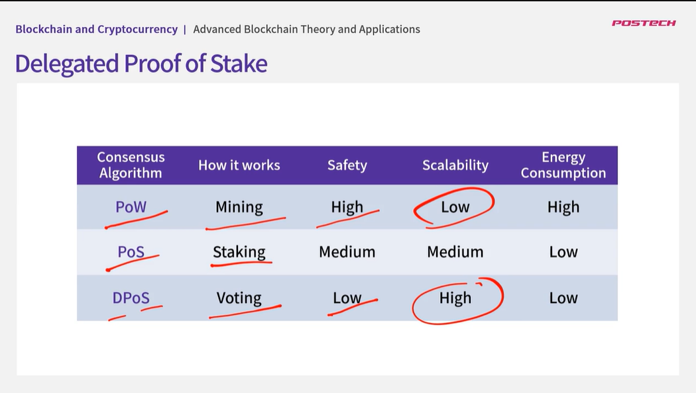
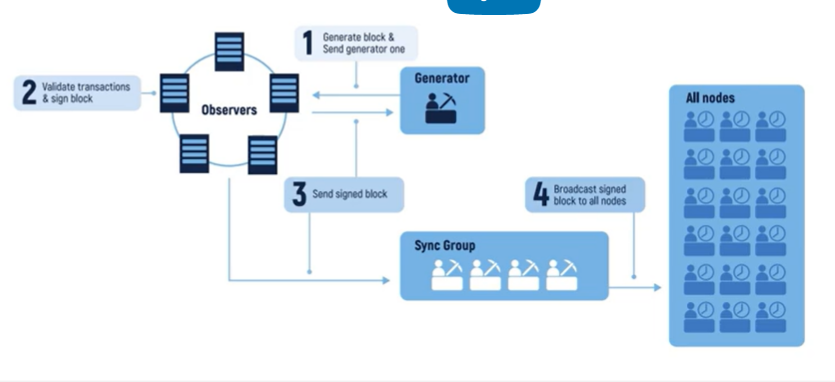

## 1.1. Introduction to the Course

    - Advanced Consensus Algorithms
    - Blockchain Scalability
        - 확장성, 안정성, 탈중앙화 3가지를 동시에 만족시키기 어렵다.
        - 사용자가 늘더라도 TPS(Transaction per seconds)에 문제가 없도록 하는 방법 소개
    - Mining Pool Protocol
    - Ethereum 2.0
        - PoW => PoS
    - Decentralized Identity
        - 개인의 신원을 개인이 관리

## 1.2. Review of Basic Consensus Algorithms

- Needs of distributed consensus
  - 중앙 통제장치가 없는 상황에서 모두가 동일한 장부를 갖고있다.
  - 네트워크의 제약사항에도 불구하고 모두가 동일한 데이터를 갖고 있어야 한다.
- Block chain
  - 장부는 블록 단위로 나누어서 구성되어 있고
    - 블록에는 일정한 수의 거래 내역이 작업 증명과 함께 담겨 있으며
    - 그 블록의 해쉬값은 정해진 만큼의 여러 자리수의 0으로 시작한다.(매직넘버)
    - 각 블록은 자기보다 앞에 있는 이전 블록의 해쉬값을 포함한다.
    - 만약 장부를 변경하거나 순서를 변경한다면 해쉬 값이 변경되게 되고 연쇄적으로 해쉬값을 변경하게 된다.
    - 이경우 결국 매직넘버를 찾기위해 작업 증명을 다시 해야된다.
    - 작업 증명을 통해 해쉬 값을 찾으면 코인이 보상으로 주어진다.(+ 수수료)
    - 매직넘버는 코인에 따라 일정 주기별로 풀수 있도록 랜덤하게 변경된다.
- Proof of Work
  - https://namu.wiki/w/proof-of-work
  - 해시 함수 계산을 통한 가장 많은 계산 작업을 통해 체인이 가장 많이 연결되어있는 장부가 신뢰할 만한 올바른 장부이다.
  - 한 마이너가 전체 작업의 51%을 처리가 가능하다면 장부를 조작할 수 있다.
  - 단점
    - 불필요한 전력소모
    - 마이너들 끼리 pool을 만들어 컴퓨팅 자원을 합치고 보상을 나눠갖는 체계를 만들게 되었고 결국 중앙화를 이루게된다.
- Proof of Stake
  - https://www.youtube.com/watch?v=M3EFi_POhps&ab_channel=SimplyExplained
  - 다음 블록을 생성하기위한 후보를 선출한다.(validator)
  - 노드들은 일정 코인을 보증금으로 걸게 된다.
  - 보증금의 양에 따라 다음 validator에 뽑힐 확률이 높아진다.
  - 선출된 노드들은 블록을 블록체인에 추가하게 되고 수수료로 코인을 받게 된다.
  - 작업이 끝난 후 코인은 바로 돌려받지 않고 검증을 거치게 된다.
  - 만약 validator에게서 부정행위가 발생되면 보증금을 압류한다.
  - 전체의 51%의 코인을 갖고 있다면 장부 조작이 가능하다.
  - 단점
    - 코인을 많이 가지고 있는 사람은 validator로 선출될 확률이 높아지고 선출되면 fee를 받으므로 계속 부자가 될 확률이 증가한다.
    - nothing at stake(전혀 위험하지 않다.)
      - 
      - 새로운 블록의 출현으로 스프트 포크가 발생한다면 둘중 아무거나 투표하여 선정하게 됨 validator 은 리스크가 없기 때문에
      - 이 문제를 해결하기 위해...
      - Mining-based PoS(Peercoin, Nxt)
        - staking한 코인의 양에 비례해서 mining이 쉬워짐
      - Leader-based PoS(Cardano)
        - staking한 코인에 비례해 미리 리더를 선출하여 블록 결정을 맡김
      - Voting-based PoS(Ethereum 2.0)
        - validator 선출 랜덤
        - staking한 코인에 비례해 투표력이 강해지고 보상이 정해짐
- Hybrid PoW+PoS
  - 참여자들의 Computing power + Staking한 코인예 비례해 채굴이 쉬워짐
  - 또는 PoW로 생성된 블록을 PoS방식으로 검증
  - QuarkChain, Hypercase, Decred

## 1.3. Delegated Proof of Stake

- 위임 지분 증명
  - 자신이 가진 지분을 이용해 블록 생성을 취한 투표를 한다.(PoS와 같음)
  - 간접민주주의 방식
  - 투표를 통해 대표를 선출하고 선출된 대표자(validator)들에게 권한 위임
  - 블록이 빠르게 생성됨
  - Steam, EOS, Ark, Lisk
  - 
  - 단점
    - 소수의 대표들로 전체가 운영되기 때문에 중앙화됨
    - 51% attack(소수의 대표자가 존재하기 때문에 공격당하기 쉬움)

## DDPoS(이중 지분 증명)

- 대표자외에 랜덤하게 선정된 노드들을 추가하는 방식
- Sigma Chain, Futurepia

## Hyper Delegated Proof of Stake

- DPoS + Peer Reliability Rate(PRR)
- 일정 수준의 PRR 값을 받아야 대표로 선정됨
- Network & Hardware utilization
- Responsibility
- Reactivity
- Interoperability(상호 운용성)
- MoFAS에서 사용중

## 1.4. Proof-based Consensus Algorithms

- Proof of Authority(PoA, 권위증명)

  - 사용자의 평판을 이용해 validator 선정
  - 공개적으로 검증된 노드들만 선정됨
  - 매우 빠름
  - 신뢰할 만함
  - 단점
    - 중앙화됨
  - Luniverse

- Proof of Burn(PoB, 소각증명)
  - PoS와 유사
  - Staking대신 코인을 다시 사용할 수 없도록 소각함으로써 다음 블록을 생성할 수 있는 확률이 증가됨
  - 에너지 소모가 적음
  - mining hardware가 필요치 않음
  - 더 많이 소각할 수록 채굴확률이 증가하기 때문에 miner들의 참여를 독려함
  - 단점
    - 느림
    - 코인 소각 채굴계좌 투명성이 없다.
  - ZCoin

## Proof of Importance(PoI, 중요도 증명)

- 사용자들이 활동을 많이 할 수록 보상, 블록생성 확률 높아짐
- 작고 많은 거래량이 증가할수록 활동이 많음
- 최소 10,000 coins가 필요
- get transaction fee
- NEM에서 사용중

## Proof of Elapsed Time(PoET, 경과 시간 증명)

- 참여자들은 무작위 시간 할당받고 참여자들은 대기해야함
- 가장면저 경과 시간을 완료한 노드가 다음 블록 생성자가 됨
- 신뢰할 만한 환경 필요(Intel's Software Guard Extension)
- 매우 빠름
- 랜덤한 시간으로 효울적이고 공평함
- 확장성 높음
- 단점
  - 중앙화, 실행환경에 크게 의존
- EdenChain, Hyperledger Sawtooth

## Proof of Formulation(PoF)

- 블록의 채굴자와 validator의 순서를 사전에 정해놓음
- 매 cycle마다 채굴, validator, 최종적으로 block을 chain에 추가하여 전파하는 sync node들이 정해짐
- 
- 빠름
- Prevent fork

## Proof of Brain(PoB, 두뇌 증명)

- 토큰 보상의 대부분을 컨텐츠 제공자들에게 분배하는 시스템
- Steemit, Steem
- Steem에서는 DPoS를 이용해 블록 생성 검증
- Steem 블록체인에서 발행되는 토큰의 대부분은 두뇌 증명을 통해 사용자들에게 분배됨

## Proof of Believability(PoB)

- 참여자들에 신뢰성에 비례해 validator 참여 확률 높아짐
- 참여자들의 토큰 보유량, 거래량, 커뮤니티 참여 기여도, 노드 review 등에 의해 선출됨
- 탈중앙성, 확장성, 보안성
- IOST에서 사용됨

## Proof of Capacity(PoC, 용량 증명)

- PoW와 비슷함 단, 저장공간에 비례해 다음 블록 채굴 확률 늘어남
- 하드드라이버 저렴
- Burst Coin
