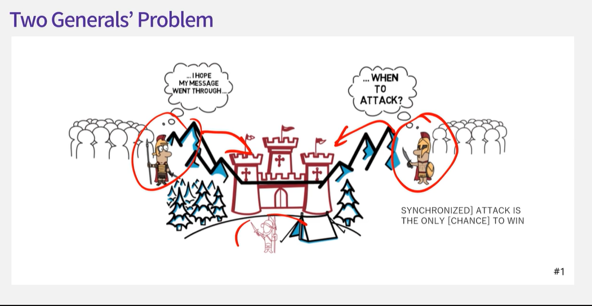
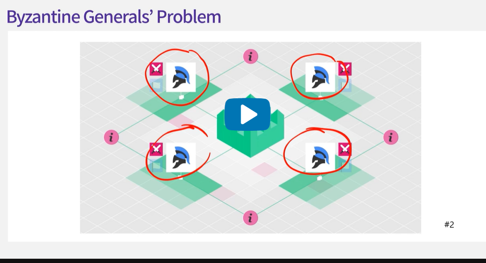
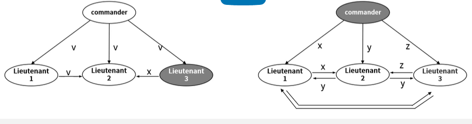
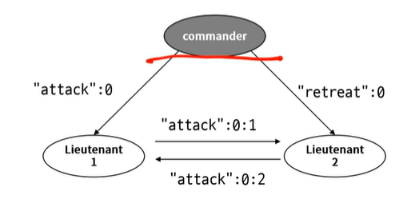
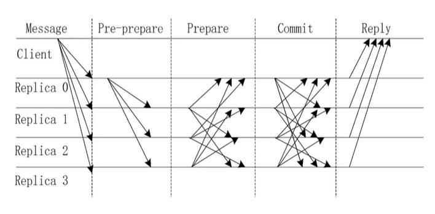

## 2.1. Byzantine Generals’ Problem

- 동기성, 비동기성
- FLP Impossibility
  - 비동기 시스템에서 Safety, Liveness, Fault tolerance 모두를 충족시키는 합의 알고리즘을 구현할수 없다.
    - Safety
      - An agreement reached across nodes is valid and consistent
      - Something bad never happen
    - Liveness
      - Nodes eventually reach an agreement
        Something good eventually happens
    - Fault tolerance
      - A protocol works properly even some failures
- Byzantine Fault Tolerance
  - 분산 네트워크 환경에서, there can be malicious nodes
  - Use BFT-based algorithms for correct decision making
  - BFT-based algorithms are effective for closed network, permissioned blockchain
- Crash Fault Tolerance(Non-Byzantine)
  - Consider only crash faults: nodes do not work properly
  - CFT-based algorithms can be only used in reliable network, private blockchain.
- Two Generals' problem
  - 공격이 성공하기 위해서는 두 장군이 동시에 공격해야 한다.
  - 메신저는 적진을 통과해야 한다.
  - 메신저가 적군에게 잡힐 수도있다.
  - 안전하게 합의에 도달할 방법이 존재하지 않는다.
  - 
- Byzantine Generals' Problem

  - 장군들은 공격/후퇴를 하기위해 동의를 얻어야 함
  - 
  - 메시지는 전달과정 중에서 변조될 가능성이 있다.
  - 장군, 사령관 중에 배신자가 있을 수 있다.
  - 배신자가 아닌 모든 장군들은 지시를 이행한다.
  - 사령관이 배신자가 아니라면 배신자가 아닌 장군들은 지시를 이행한다.
  - 전체 장군의 수가 3m+1(m=배신자)보다 적으면 합의를 이룰 수 없다.
  - 해결책

    - Oral Messages algorithm

      - 모든 메시지들은 올바르게 전달되며, 메시지를 전달받은 사람은 누가 전송했는지 알 수있고, 메시지를 받지 않았음을 알수있다 라는것을 전제로 함
      - 
      - 장군 1명이 배신자일 경우 다른 2명이 받은 값에 따라 합의 가능
      - 사령관이 배신자일 경우 중앙값을 이용해 동일한 합의 가능
      - 단점
        - 장군이 많아질 수록 소통이 기하급수적으로 많아짐

    - Signed Messages
      - 서명이 위조될 수 없고, 위조될 경우 누구나 검증 가능
      - 사령관이 자신의 서명을 담아 메시지 전송, 장군들은 자신의 서명을 추가하여 다른 장군들에게 전달
      - m+2(m=배신자)명의 장군들이 필요
      - 만약 공격/후퇴가 동점이라면 미리 정한 약속을(후퇴) 이행한다.
      - 서명으로 인해 누가 배신자인지 알 수 있다.
      - 

## 2.2. Byzantine Fault Tolerance

- f개의 악의적인 노드가 존재할 때 3f+1개의 노드가 존재할 때 실용적으로 사용 가능하도록 만들어짐
- Practical Byzantine Fault Tolerance
  - 
  - request: client의 요청이 서버로 전달된다.
  - 3번은 장애가 발생한 노드
  - pre-prepare: 0번째 서버에서 1,2,3 번째의 서버로 전송한다.
  - prepare: 2개의 노드가 올바른 메시지를 전달하기 때문에 모든 노드는 정상적인 메시지 받음
  - commit: 각 노드들은 검증하고 committed 상대가 된다.
  - reply: 올바른 메시지를 받았다면 요청사항이 정상적으로 확인됐다.

## 2.3. Crash Fault Tolerance
