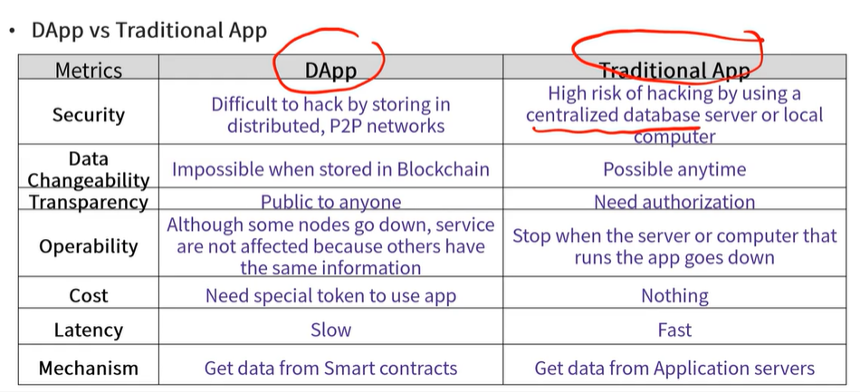

## 2.3 비트코인 마이닝

Mining

- solve math puzzle
- Meaning block and Bitcoin generation

Incentive

- Reward + Transfer Fees for New Block Creation
- Half of the compensation for block creation every four years
- Maximum Bitcoin issue: 21 million

Limitation of Bitcoin

- Latency

  - Block Generation Cycle 10 Minutes
  - Transaction completion cannot be verified immediately
  - Time included in the block varies depending on transfer fee

- Scalability Problem

- Computing Resource Problem
  - energy consumption problem
- Lack of Smart Contraction Functions
  - Designed for Cryptocurrency trading
  - So, we cannot apply smart contractions other than very simple contracts

## 2.4 Introduction of Ethereum

- 창시자

  - Vitalik Buterin

- 공개

  - 2015년

- 블록체인 1.0(대표: Bitcoin)
  - 화폐저장 수단에 집중
- 블록체인 2.0(대표: Ethereum)

  - It can records not only currency transactions but also additional information and processes such as contracts

- Bitcoin
  - 화폐 거래됨/거래 되지 않음 상태 알수 있음
  - 화폐를 쪼개서 보냄
  - Block generation time about 10 minutes
- Ethereum
  - 화폐단위: ETH
  - 여러 상태 기록 가능 through smart contracts 예: 거래 중, 입금 확인 등 왜냐면 코드가 들어갈 수 있기 때문에
  - 화폐를 한번에 보냄
  - Block generation time about 15 seconds

## 2.5. Characteristics of Ethereum

- Smart Contract
  - Computer protocol for establishing, validation and executing specific contracts digitally
  - First Smart Contract: 1994 Byt Nick Szabo
  - Benefit
    - High security, low cost, automated execution, clear results
- Problem of Smart Contract

  - 결국은 사람이 만듦

- DApp(Decentralized Application)

  - 블록체인 위에서 동작하는 앱
  - 중앙서버 없이 정보 분산
  - provides services through smart contracts stored in the Blockchain

- DApp vs Traditional App

