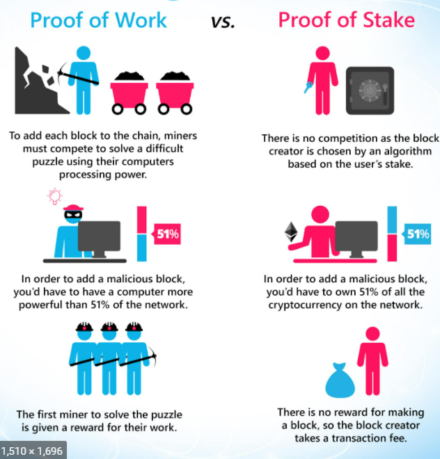

## 3.1. Public & Private Blockchain

- Public Blockchain

  - Permissionless blockchain
  - 누구나 참여 가능
  - 누구나 transactions 기록 보기 가능
  - computing과 networking operations 에 참여하면 보상 받음
  - 비트코인, 이더리움, ...

- Private Blockchain
  - 관계자에게 승인 받아 참여
  - 승인 받은 nodes만 참여하고 거래 내역을 볼 수 있음
  - 보상이 없음
  - Hyperledger Fabric, R3, ...

## 3.2. Blockchain3.0(EOS)

- C/C++ 사용
- Platform for developing DApps
- Fast transaction processing

  - Block generation time 0.5s
  - 초당 약 4000개의 거래
  - Future Goal
    - Single Thread 1만 거래 목표
    - Multi Thread 10만 거래 목표

- 합의 알고리즘(Consensus Algorithm)

  - DPoS(Delegated Proof of Stake)
    
  - 21명을 투표해 참여시킴(Block producers)

- No transaction fees

  - Dapp 에서 부담하는 구조, 전체 EOS처리량 중 Dapp에서 원하는 처리량을 가지려면 그 만큼의 EOS를 가지고 있어야 함

- On-chain governance
  - 블록체인을 결정하는 주체가 기존과 다르게 내부에 존재
- 가장 활발한 거래량을 가짐

## 3.3 Hyperledger Fabric

- Open source
- Private Blockchain
- Enterprise Blockchain
- 여러개 중 대표: Hyperledger Fabric
  - Private Blockchain(허가 받은 사용자만 참여가능, 보상이 없음)
  - Plug & Play
  - Channels
    - 전체 시스템을 다수의 채널로 분리, 멀티 블록체인 운영 가능
    - 채널 별로 독립적인 블록체인 사용
    - 사용자는 원하는 채널 선택
    - 동시에 여러 블록체인에 접근 가능
  - Consensus Algorithm
    - 원하는 방법 사용 가능
    - SOLO, Kafka, ...
  - Chaincode
    - smart contract와 비슷
    - Node.js, Go 사용해 개발 가능
  - 병렬 처리로 초당 1만 거래 처리 목표
  - 거래 블록 생성 즉시 승인

## 3.4 ICON

- Korea's leading blockchain platform
- Enterprise Blockchain
- LoopChain
  - 금융거래 지원 목적
  - 사물 인터넷 등 범용성으로 사용되도록 목표
  - 블록체인 기본에 충실한 구조
  - 중앙에서 트랙잭션 순서를 정해줌
  - 이해관계가 있는 노드들이 반영구적으로 네트워크 구성
  - Score를 통해 개발 환경 구성
  - 중개자 없이 당사자간 합의 알고리즘 사용
  - 독립적인 가상환경 지원, Multi Channel
- SCORE

  - 어떠한 언어로든 구현 가능하나 Python 최적화
  - 읽고 쓰고한 결과만 저장됨

- LFT
  - 합의 알고리즘
- MyID
  - 모바일 신분증 서비스
- Broof
  - 증명서 발급/조회 서비스
