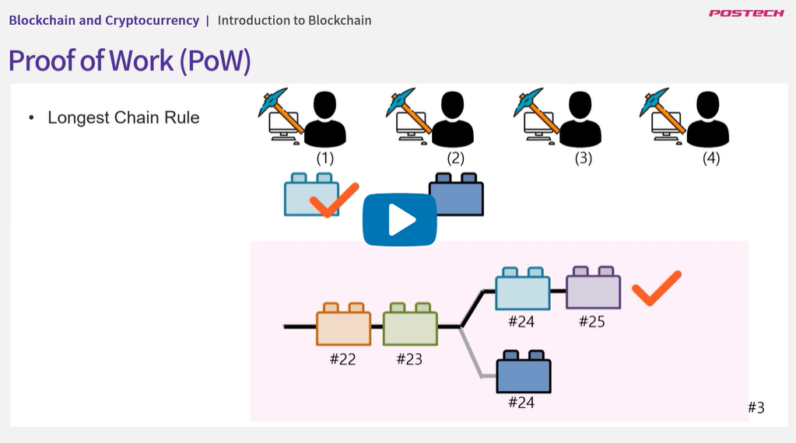
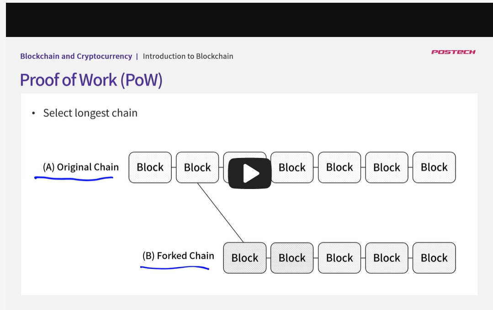
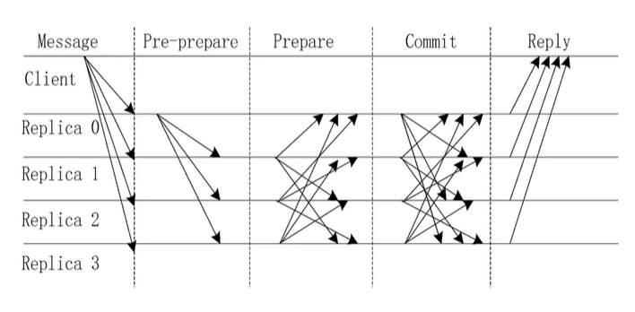

## 4.1. Distributed Consensus

- 동시에 두개의 노드가 유요하다면 어떤 것을 선택할지 합의 알고리즘 필요
- 의견 통일, 블록 생성 권한, 블록체인 사용자가 동일한 결과 유지에 필요
- Distributed Consensus의 문제
  - 노드가 불안정할 수 있음
  - 네트워크 불안정
  - 네트워크에 조작된 값이 있을 수 있음
  - 통신량이 많아 지연 가능성
- 대표 알고리즘
  - PoW
  - Pos
  - DPoS
  - PBFT
- Safety가 보장이되어야 한다, 노드간 합의가 되었다면 어느 노드가 접근하든 그 값은 동일하여야 한다. (Blockchain finality와 동일)
- Liveness, finality가 문제가 없다면 네트워크 상에서 반드시 합의가 이뤄진다.
- 하지만 비동기 네트워크 상에서 Safety, Liveness 둘다 보장될 수 없다. (FLP Impossibility), 즉 비동기 네트워크 상에서는 합의 문제를 완벽히 해결할 수 있는 분산 합의 알고리즘이 존재하지 않는다.

## 4.2. Proof of Work

- Bitcoin, Ethereum, ...
- 작업 증명
- 블록내의 값을 0부터 1씩 증가시키면서 해쉬 함수에 넣으면 그 값이 목표 값보다 작은 값이 나오면 채굴 성공, 확률이 희박하다.
- 많은 컴퓨팅 자원 필요
- 만약 동시에 블록이 생성될 경우 다음의 채굴 성공자가 블록을 먼저 잇는쪽이(길어지는 쪽이) 블록을 유지하게 됨
  

- 만약 네트워크 문제로 체인이 두개로 갈라졌다면 더 긴체인을 선택, 단 보통 확률적으로 6개의 대립된 블록이 생성되기 전에 종료됨(6 Confirmation) 즉, 자신이 생성된 블록 외에 5개가 더 추가되어야 거래가 종료됨
  

- 작업증명은 일시적으로 합의가 깨질 수 있으나 결국에는 합의되는 알고리즘
- 퍼즐을 먼저 맞추는 사람에게 블록을 생성해주는 합의 알고리즘
- 컴퓨팅 파워가 강한 단체에게 중앙화 되는 위험이 있음

## 4.3. Proof of Stake

- Ethereum 2.0, Quantum, ARDR, STRAT, ...
- 위임 지분 증명
- PoW에 비해 채굴이 필요하지 않기 때문에 에너지 소모를 줄일 수 있다.
- 지분에 비례해 블록이 생성되기 때문에 중앙화의 위험을 줄일 수 있다.
- 이미 채인에 연결된 블록들이 변경되기 힘들게 만듦
- 공격자의 지분을 0으로 만드는 패널티 존재
- 코인 보유량으로 이자를 받기 때문에 코인 유동성이 감소되는 단점 보유
- 검증되지 않은 합의 알고리즘으로 보안 이슈 존재 가능성 있음
- 자산을 갖은 사람들이 전부 참여하여 자신의 권리를 직접 행사하는 방식(직접 민주주의)
- 모두 참여하기 때문에 블록 생성 느림

## Delegated Proof of Stake(DPoS)

- Steem, EOS, ARK, RIST, ...
- 투표를 통해 대표 선출, 대표자(validators)들에게 권한 위임(간접 민주주의)
- 소수만 참여하기 때문에 블록이 빠르게 생성됨
- Each blockchain has a different number of validators(Steam and EOS have 21, ARC has 51 and RISK has 101)

## 4.4. BFT & PBFT

- 비잔틴 장군 문제(Byzantine General Problems)

  - 각 장군이 자신의 군대를 가지고 있고 공격하려는 도시가 아닌 다른 도시에 있다고 가정
  - 장군들은 공격, 후퇴하기 위해서는 합의를 얻어야 함
  - 모든 장군이 동의한다면 문제 없음
  - 1. 각 장군은 공격/후퇴를 결정한다
  - 2. 결정 번복 x
  - 3. 모든 장군이 같은 결정을 해야하고 동시에 실행해야 함
  - 의사소통 문제는 전달자에 의해서만 소통을 해야한다는 것에 의해 발생
  - 어떤식으로든 메시지가 소실되거나 늦거나 변질될 수 있음
  - 메시지가 성공적으로 전달되더라도 한 명이상의 장군들이 악의적으로 행동할 수도 있음 또는 가짜 메시지 보낼 수 있음
  - 달리말하자면 분산 네트워크 대다수 참여자들은 완전한 실패를 막기위해 동일한 행동을 하기로 결정하고 이를 실천해야 한다. 이는 대다수의 참여자가 악의적으로 행동한다면 시스템이 실패하거나 공격받을 수 있다는 것을 의미

- Byzantine Fault Tolerance(BFT)

  - 일부노드가 고장나거나 악의적으로 행동하더라도 계속 작동할 수 있음
  - 장애 허용 알고리즘
  - PoW, PoS

- Practical Byzantine Fault Tolerance
  - Liveness를 좀 희생하더라도 비동기 네트워크에서 Safety를 보장할 수 있는 알고리즘
  - 네트워크내에 배신자가 있어도 어느정도 신뢰 합의 보장
  - PBFT is an algorithm that mathematically proves that when there are "f" traitors in an asynchronous network, the consensus made in that network is reliable if the total number of nodes is 3f+1
    
