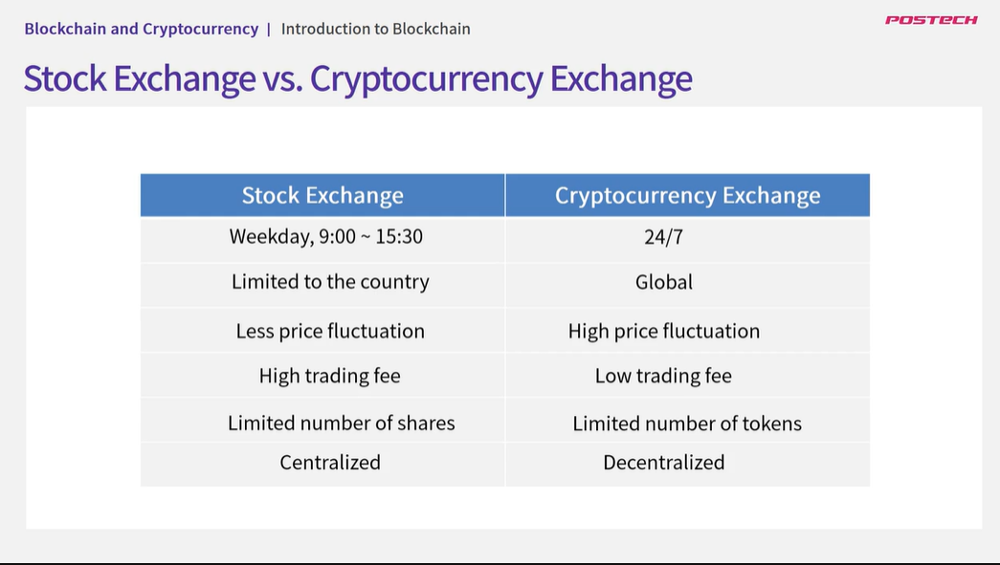

## 6.1. Wallet

- 비트 코인 같은 암호화폐를 보관할 수 있는 저장소 역할
- 실제 암호 화폐가 들어있지 않음
- Key Storage
  - Public key/ Private Key를 보관하고 있음
    
- 암호화폐 거래소 이용시 지갑이 자동 생성되고 키를 거래소에서 관리하게 됨
  - 따라서 해킹당하거나 거래소가 망하면 자산 보호를 보장할 수 없음
- Hot Wallet

  - 인터넷에 언제나 연결되어있어 빠름
  - 해킹에 취약함
  - Desktop, Mobile

- Cold Wallet
  - 오프라인
  - 해킹 불가능
  - USB, Hardware Wallet
- Paper Wallet
  - Print private key
  - 매우 높은 암호화 수준 제공

## 6.2. Cryptocurrency Exchange(암호화폐 거래소)

- Coinone, Upbit, Bithumb, Binance

- 기존 증권 거래소 vs 암호화폐 거래소
  
- 중앙집중화 암호화폐 거래소

  - 일반 주식시장 처럼 거래 가능한 거래소
  - 거래소를 통해 이뤄지는 모든 거래가 완벽하게 통제됨
  - Coinone, ...
  - 문제점
    - 거래소 소유의 암호 지갑 사용
    - 입/출금이 통제됨
    - 자금 손실 및 도난의 위험
    - 많은 해커들의 타켓이 됨
    - 블록체인이 분산화 방식이지만 거래소는 중앙 집중화
    - 요금
    - 일반 통화 <=> 암호화페 교환 가능

- 분산 암호화폐 거래소
  - 사용자가 자신의 자산 직접 통제
  - 사용자 끼리 직접 거래하기 때문에 요금이 없거나 저렴함
  - EtherDelta, WavesDEx, AirSwap, BancorProtocol, ...
  - 거래량과 이동성이 낮아 거래자가 원하는 시간에 구입 할수 없음
  - 블록체인에 기록이 되어야하기 때문에 시간이 많이 소모됨
  - 암호화폐간의 교환만 가능함

## 6.3. ICO, IEO, STO

- ICO (Initial Coin Offering)
  - 블록체인 개발자들이 초기 개발 자금을 모으기 위한 수단
  - The development team that wants to ICO will write and publish a white paper(백서) describing key information such as project objectives and capabilities
  - A successful ICO requires solid evidence to support how the project will be used, why it is valuable, who needs it, and how it can be developed
  - 암호화폐를 통해 펀딩, ICO에 참여한 투자자들은 개발자들이 발행한 토큰을 부여받게 됨
  - 기존의 방식인 IPO(Initial Public Offering)와 다름
    - IPO는 지분을 분배해 투자를 받음 단, ICO는 토큰을 구매했다고 해서 소유권, 지분을 얻지 않음
    - ICO는 IPO와 비해 기간이 짧고 누구나 가능
  - Ethereum, ICON이 IPO를 통해 시작
  - 중국, 한국에서는 ICO 허용하지 않음
  - ICO이후 4개월 후 살아남은 스타트업은 약 40%
  - 해당 암호화폐가 존재하는 심사 기준에 따라 바로 생성되지 않음
- IEO (Initial Exchange Offering)
  - 거래소가 투자를 대신 진행해주는 것
  - 투자자가 믿을 수 있는 거래소를 통해 간접 투자하는 방식
  - 최소한의 제품을 개발해놓고 투자 진행
  - 암호화폐가 거래소에 바로 상장되어 거래 상장 수수료 절감 가능
  - GIFTO, BREAD가 Binance를 통해 성공적으로 출시됨
  - 문제
    - 암호화폐 거래소를 통해 출시되기 때문에 거래소의 신뢰성이 중요(중앙화 되었기 때문에 거래소에 의존적임)
- STO(Security Token Offering)
  - 코인으로 자산을 증권화해서 사고팔수 있는 개념
  - 회사 주식, 부동산, 미술 작품 등 모든 것을 토큰화하여 자산에 여려명이 투자하고 소유권과 투자 내역을 블록체인으로 보장받음
  - 금융당국에 규제를 받아 상대적으로 안전함
  - 블록체인의 스마트 컨트렉트 바탕으로 모든 정보를 실시간으로 관리할 수 있기 때문에 간편하게 자금을 조달 가능

## 6.4. DeFi(Decentralized Finance, 탈중앙화) 개요

- 블록체인 네트워크 상에서 작동하는 금융 어플리케이션 생태계
- 어떠한 중앙 기관, 중재자없이 작동하는 금융 서비스
- 사용자는 언제나 자신의 자산에 대한 통제권 유지
- 검열, 잠재적인 서비스 중지 발생 어려움
- 기존 금융서비스 접근 어려운 사람들이 쉽게 접근 가능
- 단점
  - 개인이 자산을 완전히 통제하는 것은 위험하다, 분실
  - 스마트 계약의 복잡성은 해킹의 위험 존재
  - DeFi 규제 모호함
- Borrowing & Lending(대출 서비스)
  - 즉각적인 거래 채결
  - 디지털자산을 담보로 삼을 수 있음
  - 신용확인 불필요
  - 최소화된 신뢰만 있어도 가능
  - 저렴함
- 예: 탈중앙화 거래소
