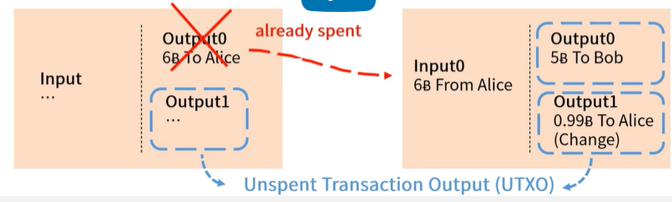

## 1.2. Smart Contract 101

- A contract is the basic building block of a market economy
  - Chop, Seal, Signature
- Smart contract
  - 닉 자보에 의해 처음 제시되었음
  - 계약을 컴퓨터 프로그램으로 구현
  - 다양한 계약 가능(부동산 계약 등)
  - 종이 계약과는 다르게 일정한 조건이 충족되면 계약이 자동으로 실행 됨
  - Ethereum을 시작으로 관심이 많아짐

## 1.3. What is Bitcoin?

- 화폐로도 이용될 수 있다.
- 정부의 규제나 간섭으로부터 자유로워 투자의 대상
- 송금 기술/소프트웨어, 누구나 사용 가능하다.

## 1.4. How Bitcoin Works

- 이중 지불 문제를 해결하기위해 제안되었다.
  - 가상화폐는 쉽게 복사가 가능하다.
  - 한 사람이 A라는 물품을 결재 진행중일 때 B라는 제품 또한 결재한다면
  - 블록체인이 두 갈래로 나뉘게 되고
  - 가장 긴 블록이 연결된 곳이 최종적으로 살아남는다.
  - 최종적으로 하나의 거래만 이뤄진다.
- Distributed Ledger
- Bitcoin Transactions & Blockchain
  - 분산 장부에는 개인들간의 거래 정보가 모아서 만들어진 블록이 체인처럼 연결되어 기록되고 이렇게 기록된 내용의 위조와 변경을 막기위해서 암호용 해시함수를 이용한다.
- Cryptographic hash functions
- Proof-of-Work

## 1.5. Bitcoin Transactions

- 각 트랜잭션은 인풋과 아웃풋이 있다.
- 앨리스가 밥에서 5B을 준다면 트랜잭션은 아래와 같다.
  - 
- 앨리스의 6B은 어디서 왔을까? => 데이비드
  - 
- 사용된 트랜잭션은 아웃풋과 인풋으로 체인을 이루게 된다.
- 이때에 사용되지 않은 Output들은 Unspent Transaction Output(UTXO)이라고 부른다.
  - 
- 비트코인은 UTXO set을 통해 어떤 코인이 안쓰였는지 빠르게 확인이 가능하다.
- Output은 2개의 속성으로 이뤄져있다.
  - Bitcoin 수량
  - locking script(누구에게 보낼것인지)
  - 
  - 
- Input은 4개의 속성으로 이뤄져있다.
  - Transaction ID
  - Output Index
  - unlocking script
  - sequence number
  - 
  - 
