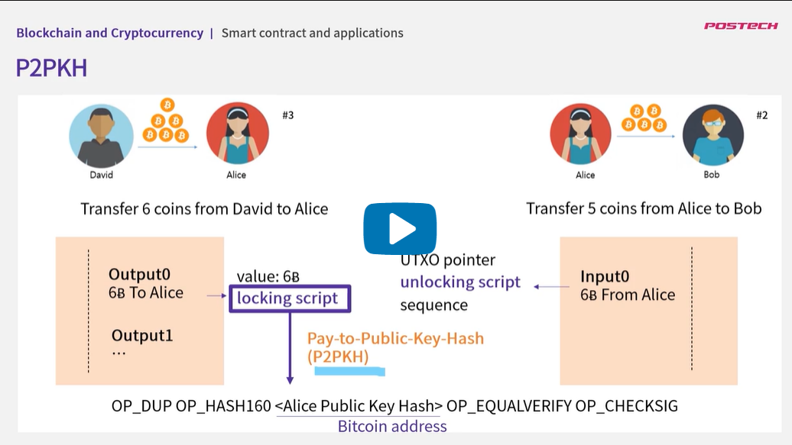

## 2.1. Keep the Change

1. UTXO를 연결해보자.
   - 
2. Bitcoin Explorer에서 확인 가능하다.
   - 
3. 보내는 금액 외의 잔돈이 없어졌다.
   - 
4. UTXO Model에서는 잔돈을 보관하지 않기때문에 어떡게해야할 지 결정해야 한다.
5. Output이 여러개일 수도 있으므로 남은 금액은 자신에게 돌아오도록 만들어야 한다.
   - 
6. 잔돈 거슬러주기
   - 
7. fee가 낮을경우 블록으로 추가가 느리다.

## 2.2. Bitcoin Scripts(Locking, Unlocking)

- 만약 앨리스가 밥에게 5B를 보낼 때 어떻게 거래가 유효한지 검증하는가?
  - 
- 먼저 Input 포인터를 이용한다.
  - 
  - 먼저 unlocking script를 먼저 실행하고
  - locking script를 실행해서
  - locking script가 명세한 조건은 unlocking script가 만족시키는지를 확인한다.
  - 이를 통해 앨리스의 UTXO가 아직 안쓰였다는 것을 검증한다.
- 스크립트가 실행된다는 것은?
  - 예를들어 2+3을 한다면 23+로 변경된다.(postfix notation)]
  - stack을 통해 계산된다.
  - script를 전부 실행시킨 후 stack top의 결과가 참이거나, 0이 아닌 수이거나, stack에 아무런 값도 없을 경우 유요한 transaction이라 판단한다.
  - 하지만 false, 0, script 수행 중에 정지되는 경우 transaction이 유용하지 않다고 판단한다.
  - 
- P2PKH (pay-to-public-key-hash)
- 
- locking script는 <public key hash를 검증하는 locking script><public key로 부터 만들어진 public key hash> <public key hash를 검증하는 locking script> 으로 이뤄져있다. 이 경우를 (pay-to-public-key-hash)P2PKH라고 부른다.
- unlocking script는 자신이 앨리스임을 증명하기 위해서 자신의 private key를 이용하여 signature를 만들고 이를 input script에 포함시킨다.
- 앞서 python 코드로 transaction을 만들 때 sign을 했던 이유가 바로 이 unlocking script를 만들기 위해서이다.
- <private key로 만든 signature><앨리스의 public key> 로 이뤄져있다.
- 이제 앞서 2+3예제에서 설명했던 것 처럼 검증을 진행한다.
- 
- 먼저 unlocking script를 실행한다.
- <앨리스의 Signature>, <앨리스의 public key>를 스택에 적재한다.
- locking script를 실행한다.
- OP_DUP => stack top을 하나 복제한다.
- OP_HASH160 => stack top의 해쉬값을 구한다.
- <앨리스의 public key hash> => stack 에 적재한다.
- OP_EQUALVERIFY => 두 개의 hash 값이 같은지 판별한다. 같으면 아무런 값도 추가하지 않고 2개를 지운다. 같지 않으면 실패
- 
- OP_CHECKSIG => signature와 public key를 읽고 서로 맞는지 확인한 후 true혹은 false 값을 stack에 넣는다.
- 
- 다른 조건 또한 넣을 수 있다. 예를들어 일정 시간이 지난 다음에만 코인을 사용하게 하고 싶다. 이 코인을 밥이 사용하려면 다른 사람 David의 승인을 받아야 한다 등 script를 통해서 추가 가능
- 그런 의미에서 비트코인을 programmable money라고 부른다.
- 앞서 말했던 닉 자보가 제안했던 스마트 컨트랙트가 블록체인 위에서 구현된 것이다.
