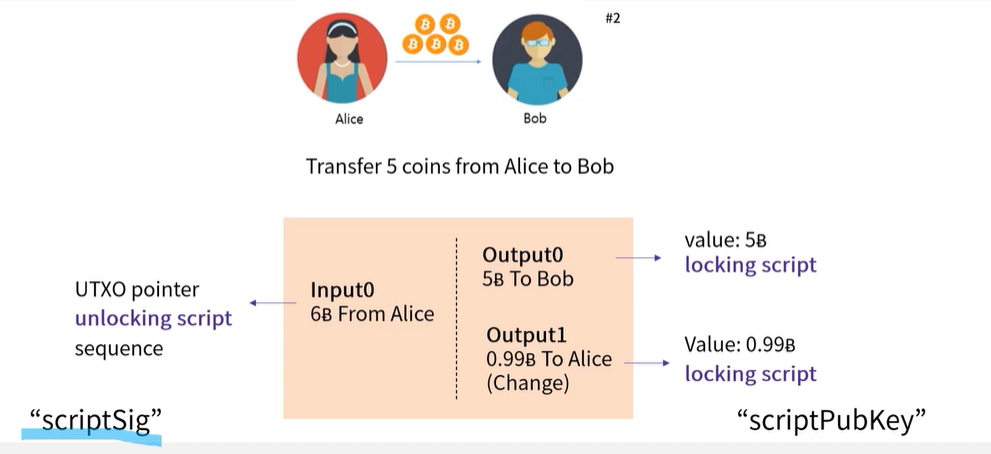
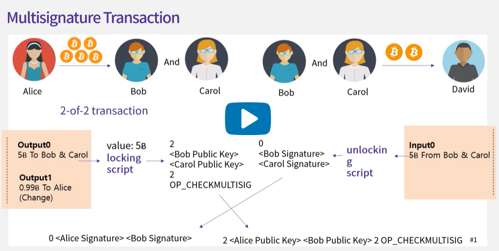
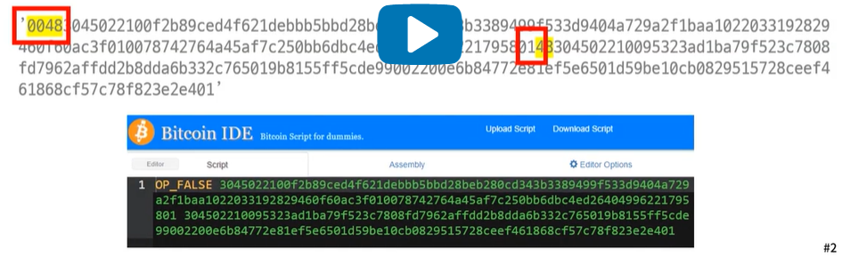

## 2.1. Keep the Change

1. UTXO를 연결해보자.
   - 
2. Bitcoin Explorer에서 확인 가능하다.
   - 
3. 보내는 금액 외의 잔돈이 없어졌다.
   - 
4. UTXO Model에서는 잔돈을 보관하지 않기때문에 어떡게해야할 지 결정해야 한다.
5. Output이 여러개일 수도 있으므로 남은 금액은 자신에게 돌아오도록 만들어야 한다.
   - 
6. 잔돈 거슬러주기
   - 
7. fee가 낮을경우 블록으로 추가가 느리다.

## 2.2. Bitcoin Scripts(Locking, Unlocking)

- 만약 앨리스가 밥에게 5B를 보낼 때 어떻게 거래가 유효한지 검증하는가?
  - 
- 먼저 Input 포인터를 이용한다.
  - 
  - 먼저 unlocking script를 먼저 실행하고
  - locking script를 실행해서
  - locking script가 명세한 조건은 unlocking script가 만족시키는지를 확인한다.
  - 이를 통해 앨리스의 UTXO가 아직 안쓰였다는 것을 검증한다.
- 스크립트가 실행된다는 것은?
  - 예를들어 2+3을 한다면 23+로 변경된다.(postfix notation)]
  - stack을 통해 계산된다.
  - script를 전부 실행시킨 후 stack top의 결과가 참이거나, 0이 아닌 수이거나, stack에 아무런 값도 없을 경우 유요한 transaction이라 판단한다.
  - 하지만 false, 0, script 수행 중에 정지되는 경우 transaction이 유용하지 않다고 판단한다.
  - 
- P2PKH (pay-to-public-key-hash)
- 
- locking script는 <public key hash를 검증하는 locking script><public key로 부터 만들어진 public key hash> <public key hash를 검증하는 locking script> 으로 이뤄져있다. 이 경우를 (pay-to-public-key-hash)P2PKH라고 부른다.
- unlocking script는 자신이 앨리스임을 증명하기 위해서 자신의 private key를 이용하여 signature를 만들고 이를 input script에 포함시킨다.
- 앞서 python 코드로 transaction을 만들 때 sign을 했던 이유가 바로 이 unlocking script를 만들기 위해서이다.
- <private key로 만든 signature><앨리스의 public key> 로 이뤄져있다.
- 이제 앞서 2+3예제에서 설명했던 것 처럼 검증을 진행한다.
- 
- 먼저 unlocking script를 실행한다.
- <앨리스의 Signature>, <앨리스의 public key>를 스택에 적재한다.
- locking script를 실행한다.
- OP_DUP => stack top을 하나 복제한다.
- OP_HASH160 => stack top의 해쉬값을 구한다.
- <앨리스의 public key hash> => stack 에 적재한다.
- OP_EQUALVERIFY => 두 개의 hash 값이 같은지 판별한다. 같으면 아무런 값도 추가하지 않고 2개를 지운다. 같지 않으면 실패
- 
- OP_CHECKSIG => signature와 public key를 읽고 서로 맞는지 확인한 후 true혹은 false 값을 stack에 넣는다.
- 
- 다른 조건 또한 넣을 수 있다. 예를들어 일정 시간이 지난 다음에만 코인을 사용하게 하고 싶다. 이 코인을 밥이 사용하려면 다른 사람 David의 승인을 받아야 한다 등 script를 통해서 추가 가능
- 그런 의미에서 비트코인을 programmable money라고 부른다.
- 앞서 말했던 닉 자보가 제안했던 스마트 컨트랙트가 블록체인 위에서 구현된 것이다.

## 2.3. Pay-to-Public-Key-Hash

- 
- David가 Alice에게 코인을 6개를 주는데 이 transaction의 locking script에 Alice의 public key를 추가해서 Alice만 사용할 수 있게 한다.
- Alice는 자신의 private key로 signature를 만들고 이를 unlocking script에 추가한다.
- 비트코인 시스템은 이 unlocking script와 locking script를 실행해서 이 transaction이 유효한지를 검사한다.
- 하나의 비트코인 노드만 검사하는 것이 아니고 모든 비트코인 노드들을 검사하고 공개된다.

## 2.4. Multisignature Transactions

- Single-signature Transaction
  - 한 사람의 signature만들 필요로 함.
  - 예를 들어 bob이 coin을 사용하기 위해서는 unlocking script를 통해서 자신의 signature와 public key를 제시했었다.
  - 그리고 두 개의 script를 합친 후 실행시켜서 어떤 transaction의 승인 여부를 확인했다.
  - 이 경우 bob만이 이 코인을 사용할 수 있다.
  - 만약에 bob의 private key를 잊어버리면 아무도 이 코인을 사용할 수 없게 된다.
  - 만약에 이 계정이 회사 계정이라면 bob은 회사의 승인 없이 맘대로 코인을 사용할 수 있다.
  - 
  - 이러한 이유 때문에 Multisignature transactions이 필요하다.
- Multisignature Transactions
  - 2명이 받은 코인을 사용할 수 있거나, 2 명이 모두 동의해야 코인을 사용할 수 있도록 한다.
  - 
  - 
  - 젤 처음부터 시작해 unlocking, locking script를 읽어 명령어롤 가져온다.
  - 
  - 명령어를 읽어서 OP_CHECKMULTISIG를 제외하고 스택에 값을 쌓는다.
  - 
    - N의 개수(public key)만큼 스택에서 값을 읽는다.
  - 
    - M의 개수(signature)만큼 스택에서 값을 읽는다.
  - 여기서기존 코드의 오류로 M만큼의 값을 읽는게 아니라 M+1만큼의 값을 읽어야 한다.
  - 그렇게 때문에 마지막 0 값이 필수적으로 들어가야 한다. 버그이지만 전체 시스템이 바껴야하기 때문에 그대로 두고 있다.
  - 

## 2.5. 2-of-2 Transactions

- Alice가 2-of-2 transaction으로 코인을 보내고, 이 코인을 두 명이 sign하여 david에게 보내는 실습
  - 먼저 Bob, Carol의 private키를 만든다.
  - 
  - 그 다음 두 사람의 private key로 public key를 생성 후 locking script를 만든다.
  - 예제에서는 2개의 M(signature) 모두가 제시되어야만 이 코인을 사용할 수 있도록 한다.
  - 
  - 만들어진 script를 복사해서 bitcoin IDE로 가져가 보면 다음과 같이 나온다.
  - 
  - 이제 Alice의 private, public key를 생성하고 UTXO 값을 살펴본다.
  - 
  - 이제 input과 output으로 transaction을 만든다.
  - 잔돈은 change address로 보낼 수 있도록 만들어야 하는데 mktx보다 mksend로 간편하게 구현하능하다.
  - 
  - 이제 만들어진 transaction을 deserialize한 다음 output의 locking script를 보면 잔돈을 자신의 address로 보내기로 했기 때문에 P2PK로 지불하는 script가 만들어진다.
  - 이 script를 multisignature로 변경한다.
  - 
  - 
  - 이제 이렇게 만들어진 transaction을 Alice의 private key로 사인하고 testnet으로 publish한다.
  - 
  - 여기까지 Alice가 Bob과 Carol에게 10,000 사토시 코인을 보냈다.
  - 
  - 이제 Bob 과 Carol에게 준 코인을 David에게 주는 코드를 구현한다.
  - 먼저 David의 public, private key를 만들고
  - 앞전에 transaction id를 찾는다.
  - 
  - 
  - fetch transaction명령을 통해서 살펴보면 이것의 transaction id가 2개가 보이는데 첫 번째는 multisignature transactino이고 두 번째는 잔돈을 위한 output
  - 이제 David에게 코인을 준다.
  - 
  - 앞전에 Alice => Bob, Carol의 거래 키를 input의 script에 넣고 input, output을 이용해 transaction을 만든다.
  - 
  - David에게 코인을 전송했다.
  - 이제 unlocking script를 만든다.
  - unlocking script는 Bob, Carol의 signature로 구성되어야 한다. 그리고 맨 앞에 0이 추가되어야 한다.
  - 
  - 
  - 
  - 
  - unlocking script는 00 + 길이 계산값 + 시그니처 + 길이 계산값 + 시그니처로 이루어져있다.
  - 
  - 그리고 이 값을 앞에서 구한 transaction의 input unlocking script 자리에 복사해서 넣어준다.
  - 이렇게 만들어진 transaction을 다시 serialize하고 testnet으로 보낸다.
  - 
  - multisignature을 통해서 코인을 더욱 안전하고 강력하게 관리할 수 있게 되었지만, 어려운 점도 있다.
  - 코드의 크기가 증가하여 시스템에 부담이 증가하고 사용자의 관계에 따라서 M 값을 1로 할지 2로 할지 서로 다른 script를 작성해야 한다.
