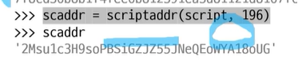
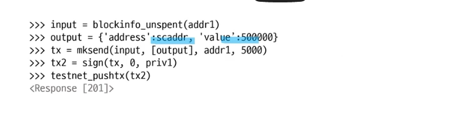
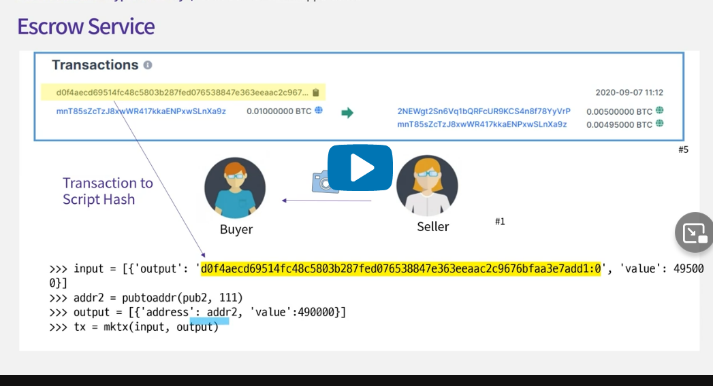
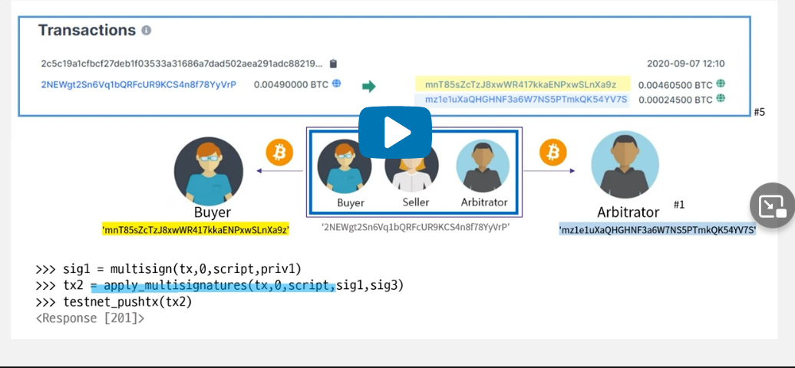

## 3.1. Pay-to-Script-Hash (P2SH)

- Multisignature의 2-of-2 transaction에서는 Alice와 Bob, Carol 모두의 signature가 필요한 transaction을 만들려면 두 명의 public key가 locking script에 포함되어 사이즈가 길어지는 불편이 있습니다.
- 그리고 Alice가 M, N값을 설정해야 한다. 이런 불편을 코인을 보내는 쪽이 아닌 코인을 받는 쪽으로 옮기 위해서 등장한 것이 Pay-to-script hash이다.
- 
- P2SH에서는 복잡한 locking script 대신에 script의 hash를 사용한다. 그렇기 때문에 UTXO의 locking script에는 script hash값 20byte만이 포함된다. 따라서 Alice는 Bob과 Carol의 관계나 이들의 public key에 대해 알 필요가 없고 script hash로 표현되는 비트코인 어드레스에 지불하기만 하면 된다.
- 
- 대신에 Bob과 Carol의 이 UTXO를 사용할 때 좀 더 복잡한 과정을 거치게 된다.
- 
- 이제 다음의 부분은 multisignature의 경우처럼 bob, carol의 signature과 0이 unlocking script에 들어가게 된다.
- 차이가 있다면 hash 값을 구하는데 사용했던 원래 script를 unlocking script 뒤에 붙이게 된다. 이것을 redeem(상환) script라고 한다.(multisignature에서 Alice의 locking script을 hash로 대채하고 Bob과 Carol이 Alice의 해시로 대채되었던 스크립트를 가져야 한다.)
- 
  이게 합리적인 이유는 Alice가 고객이고 Bob과 Carol이 온라인 상점을 운영하는 경우라면 Alice의 입장에서는 1-of-2 transaction을 원하는지 2-of-2 transaction을 원하는지에 상관없이 둘의 공동 계좌에 지불하면 그만이기 때문.

- 여기서 script hash가 공동계좌 역할을 하는 것이다.
- 어떻게 평가(evaluation)하는 가?
- 
- 먼저 순서대로 unlocking script에 있는 모든 값들이 stack에 저장된다.
- 그림에서처럼 redeem script는 op_pushdata에 의해 하나의 데이터로 stack에 놓이게 된다.
- 
- 이제 다른 transaction과는 조금 다르게 평가되는데
- 제일 먼저 현재 locking script가 P2SH인지를 확인한다.
- 어떤 특별한 코드가 있는 것이 아니고 hash 연산자 - 20 byte script hash, equal 연산자 순으로 오면 이를 P2SH로 판단한다.
- 그렇다면 stack에서 script를 꺼내서 이의 hash값을 구해서 locking script에 있는 hash 값과 동일한지 비교한다.
- 
- 비교 결과 같게 나오면 이 redeem script가 locking script처럼 실행된다.
- 먼저 M, public key, N이 stack에 쌓이고 마지막으로 checkmultisig 연산자가 값들을 읽어서 조건에 맞는지 확인한다.
- 조건에 맞으면 stack에 1이 남아 script valid한 것으로 확인되어 이 코인을 사용할 수 있게 된다.
- 다만, 조심할 점은 P2SH를 사용하면 지불할 때는 스크립트의 해시만을 사용하고 실제로 UTXO의 coin을 사용할 때에서야 스크립트를 제시할 때 스크립트가 블록체인에 기록되기 때문에 즉, 스크립트의 어드레스로 지불하는 시점에는 스크립트에 오류가 있어도 알 길이 없다.
- 만약에 스크립트에 오류가 있더라도 그 스크립트 hash로의 지불은 정상적으로 처리될 것이고 나중에 사용할 때에야 오류 때문에 사용할 수 없음을 알게 될 수도 있다. 이 경우 해당 UTXO는 아무도 못쓰게 될 수도 있으니 주의를 기울여야한다.
- 

## 3.2. 2-of-3 Transactions

- 1명이 3명에게 코인전달 후 다시 1명에게 코인 전달하는 예제 구현
- 
- 3명의 private, public key를 만든다
- 
- 이제 3사람의 public key를 사용해서 2 of 3 transaction(최소 2개의 private key가 있어야 사용가능)을 구현한다.
- 
- 
- 이제 Alice가 코인을 보내는 코드를 구현한다.
- 
- Alice는 이 어드레스로 코인을 보내게 된다.
- 
- 
- 기존의 400만 사토시 중 100만 + 요금을 제외하고 남은 잔돈은 Alice에게 돌아온다.
- 
- Pay to Script Hash(P2SH) 방식을 사용한다.
- 
- 이제 Ellen의 private, public key, address를 만든다.
- 
- 이때 처음 Alice의 거래는 index가 0인 것을 알수 있다.
- 
- 그러면 input에 index 값을 0으로 설정하고 백만 사토시를 value로 적는다.
- 
- Alice의 UTXO를 살펴보면 잔돈 2890000 사토시가 있는 것을 확인할 수 있다.
- 다시 3명이 Ellen에게 수수료 5000 사토시를 제외한 전부를 보내게 설정한다.
- 
- Bob과 David의 transaction을 자신들의 private key로 sign해서 signature을 만들고 최적저으로 transaction의 script에 추가한 후에 testnet에 publish한다.
- 
- Ellen의 어드레스를 보면 새로운 코인이 추가되었음을 UTXO를 통해서 알 수 있다.
- 
- 이제 unlocking 스크립트를 만든다. Bob과 Carol의 서명에 redeem script를 붙여서 만들게 된다.
- 
- 멀티시그니처 실용방안
- 기존에 비트코인은 어드레스에 해당하는 private key가 한 개씩 존재하고 이 키를 사용해서 transaction을 signing하게 되는데 도난, 분실 당할경우 리스크가 크다는 단점이 있다.
- 예를 들어 3개의 private key를 만들고 여러 곳에 분배하여 사용한다면 1개 보다는 안전하다.
- 

## 3.3. Escrow Contracts

- Escrow는 상거래 시에, 판매자와 구매자의 사이에 신뢰할 수 있는 중립적인 제삼자가 중개하여 금전 또는 물품을 거래를 하도록 하는 것, 또는 그러한 서비스를 말한다.
- 온라인상에서 신용카드를 사용해서 물건을 구매할 때 결재 후에도 주문을 취소하고 환불을 요청할 수 있다. 모든 정보가 카드회사에 의해서 관리되기 때문에 문제가 생기면 정정을 할 수도 있다.
- 대신에 카드회사는 카드회사는 이런 비용을 명분으로 수수료를 취한다.
- 반면에 비트코인에서는 이런 중재자가 없기 때문에 결재가 이뤄지면 이를 되돌릴 수 없다.
- 이것이 꼭 나쁘기만은 한 것은 아닌게 관리비용 및 수수료가 없어 물건값을 낮출 수 있는 요인이 된다.
- 하지만 어떤 경우에는 여전히 중개자가 필요하기도 하다.
- 이럴경우 비트코인에서는 multisignature transaction을 이용해서 소비자는 물론 판매자의 위험도 줄일 수 있게 해준다.
- 먼저 각각의 private key를 만든다.
- 실제로는 서로 private key를 공유하지 않는다.
- 
- multisig script를 만든다.
- 
- 이 스크립트의 hash를 구한다.
- 
- 이제 buyer는 이 주소로 코인을 보낸다.
- 
- 
- 
- 
- Seller는 물건값이 스크립트 해시로 지불된 것을 확인했다면
- 자신에게 지불하는 transaction을 만들기 시작한다.
- 먼저 script hash에게 지불하는 transaction을 찾아서 이를 input으로 만든다. -그리고 output은 자신 즉, seller에게 지불하도록 설정하고 이렇게 만들어진 input과 output을 통해서 transaction을 만든다.
- 
- 그리고 앞에서 만든 redeem script와 자신의 private key로 transaction을 사인해서 signature를 구한다.
- 
- 그리고 이렇게 만들어진 transaction과 signature를 buyer에게 보낸다.
- 
- 이제 물건을 받은 소비자가 물건에 만족한 경우에는 판매자가 보내온 transaction을 자신의 private key로 sign을 한 후에 publish해서 물건 값이 최종적으로 판매자에게 지불되게 한다.
- 즉, 먼저 보내온 transaction을 자신의 private key로 사인하여 signature를 구한다.
- 
- 그리고 자신의 signature와 판매자의 signature를 transaction에 적용해서 사인된 transaction을 만들고 이를 publish 한다.
- 
- 최종적으로 Seller의 UTXO를 보면 물건값이 Seller에게 지불되었음을 알 수 있다.
- 

- 만약 소비자가 돈을 보냈는데 판매자가 물건을 보내지 않는다면?
- 소비자는 중개자에게 연락하고, 중개자는 판매자와의 중재를 시작한다.
- 이 경우 중개자가 소비자에게 대금을 반환하는 transaction을 시작한다.
- 먼저 script hash에게 지불하는 transaction을 찾아서 이를 input으로 삼는다.
- 
- 또 하나는 중재자 자신에게 수수료가 지불되도록 transaction을 만든다.
- 
- 그리고 자신의 private key로 multisig script와 transaction을 사인해서 signature를 구한 후 transaction과 sig를 소비자에게 보내준다.
- 
- 이렇게 구한 최종 사인 된 transaction을 publish해서 buyer는 돈을 돌려받고 중개자는 수수료를 받고 이 거래는 끝나게 된다.
- 
- 이 모델의 장점은 분쟁이 있을 때만 중개자에게 수수료를 지불한다는 것이다.
- 블록체인 기반의 escrow 서비스에서는 거래에 사용된 자금이 hash 계좌에 머물기 때문에 보다 안전하다는 특징이 있다.

## 3.4. P2SH Puzzle

- 주어진 수식에서 한 값을 지우고 이 값을 찾는 문제를 퍼즐로 만든다. 이를 비트코인 스크립트로 만든다면?
- 

- 이렇게 확인된 스크립트를 두 부분으로 나누거 앞에 것은 unlocking script로 뒷부분은 locking script로 사용한다.
- 
- 그러면 이 locking script로 작성된 transaction에 포함된 코인은 이에 맞는 unlocking script를 제시해야만 사용할 수 있게 된다.
- 퍼즐을 푼 사람은 이 unlocking script로 자신이 문제를 풀었다는 것을 제시하고 상금은 받게 된다.
- 문제를 내는 사람은 이 locking script를 직접 사용하는 것이 아니고 이것의 hash 값을 사용한다. 그리고 이 script hash에 상금을 지불한다.
- 따라서 Output의 locking script는 20byte의 script hash를 갖게 되는 Pay-to-script-hash transaction이 된다.
- 이제 예를 들어서 Bob이 이 문제를 풀었고, 상금을 가져가려 한다고 생각해본다.
- 
- 먼저 unlocking script에 답을 적는다.
- 그리고 앞에서 script hash를 구하는 데 사용했던 script를 붙여 최종 unlocking script를 만드나.
- 그리고 이것으로 transaction을 만들어 자신에게 코인을 지불하게 하면 상금을 받는다.
- 이제 간단히 실습해본다.
- 먼저 앞에서 사용했던 예의 script를 가지고 script hash를 구한다.
- 각 명령을 16진수 opcode로 바꾸어준다.
- 숫자 데이터는 여기서 2바이트이기 때문에 그 크기를 앞에 추가한다.
- 
- Bitcoin IDE를 사용하면 script에 해당하는 encoding을 보다 쉽게 구할 수 있다.
- 
- 이제 구해진 스크립트의 hash 값을 찾는다.
- 앞에서 구한 스크립트를 scriptaddr 함수에 넣어서 script hash를 구한다.
- 이때 우리는 testnet을 사용할 것이므로 prefix 196을 추가해서 2로 시작하는 testnet용 script hash를 구해서 scaddr 변수이 저장한다.
- 
- 이제 이렇게 만들어진 script hash에 상금을 지불한다.
- 먼저 Alice의 UTXO를 사용해서 input을 만든다.
- 수수료를 제외한 금액을 mksend 명령을 이용해 transaction을 만든다.
- 
- 이제 문제를 풀고 상금을 받아본다.
- 먼저 unlocking script를 만든다.
- 정답을 적고 redeem script를 붙이는데 각각 그 사이즈를 먼저 적어주게 된다.
- redeem script의 경우 사이즈가 8, 즉 전체 길이가 8 byte이므로 8을 스크립트 앞에 넣어준다.
- 
- 이제 unlocking script가 준비 되었으니 bob은 자신에게 상금을 보내는 transaction을 만든다.
- 먼저 input에 상금이 지불된 transaction을 넣고
- 
- output은 상금이 자신에게 지불되도록 만든다.
- 
- 만들어진 transaction을 보면 아직 input section(ins)의 script 즉 unlocking script가 비워져 있음을 볼 수 있다.
- 
- 일반적인 경우에는 자신의 private key로 sign을 함으로써 unlocking script를 만들게 되지만 이번 경우에는 우리가 앞에서 만든 puzzle의 정답이 담긴 script를 사용한다.
- 
- 이제 확인해보면 상금을 받았음을 알 수 있다.
- 
- 이 Puzzle의 진짜 문제는 redeem script를 찾는 것이다.
- 예를 들어 redeem script를 재구성할 수 있는 hash 힌드를 주면
- 
- 먼저 plus와 equal을 비트코인 스크립트 opcode로 바꾼다.
- 
- 그리고 x, y 값을 추축해본다.
- 비트코인 스크립트에서는 숫자, 특히 상수 값을 표현하는 다양한 방법들이 있는데 이 예제에서는 2byte로 표현된다고 가정한다.
- x, y에 숫자를 대입하고 hash를 구한다.
- 

## 3.5. Return Transactions

- Data Recording Output => OP_RETURN
- 이 transaction은 개발자들에게 코인의 거래와 상관없는 80byte 정도의 데이터를 transaction의 output에 넣을 수 있게 해준다.
- 이전에는 사람들이 거래와 관련 없는 정보를 블록체인에 기록하기 위해서 fake UTXO를 만드는 경우가 많았는데 이러다 보니 실제로 사용할 수 없는 UTXO가 늘어나는 문제점이 생겼다.
- OP_RETURN을 사용하면 UTXO set에 들어가지 않기 때문에 사용할 수 없는 UTXO가 늘어나지 않는다.
- return transaction은 locking script의 output에 위치한다.
- OP_RETURN은 항상 invalid 한 것으로 처리되어 이 script에 대응하는 unlocking script는 없다.
- RETURN script에 코인을 포함하고 있을지라도 UTXO에 들어가지않고 그 코인은 다시 쓸수없기 때문에 일반적으로 코인을 포함하지는 않는다.
- RETURN script는 data section을 갖는데 data는 83byte로 제한된다.
- 
- 아래 사진의 transaction을 보면 output에 2개의 script가 있는데 첫 번재 것은 P2PKH이고 두번째 것은 RETURN script의 예이다.
- 
- 예에서 RETURN script에 들어간 값은 "how is everyone!"의 아스키코드를 16진수로 표현한 것이다.
- e의 ASCII코드는 16진 수로 65이다. 그래서 RETURN 뒤에 넣은 데이터에 65라고 적어준 것이다.
- 
- 위와 같이 필요한 데이터를 return operator 뒤에 추가하면 된다.
- 실제 코드예제
- 만약 Alice가 전기 회사로 전기요금을 코드로 지불하면서 7월 요금이라는 메시지를 포함시키려고 한다면
- 1. Alice와 전기회사의 private key, public key, 주소를 생성한다.
  - 
- 2. Alice의 UTXO를 보면 약 90만 사토시가 있다.
  - 
- 3. Alice의 주소를 input으로 하고 보내는 사람을 output으로하여 transaction을 만들고 수수료는 5000 사토시로 한다.
  - 
- 4. 만들어진 transaction을 보면 두 개의 output이 존재한다. 하나는 전기회사에 10만 사토시, 나머지 잔돈을 Alice에게 다시 되돌려주는 output
  - 
- 5. 이제 OP_RETURN을 이용하여 세 번째 output을 추가하여 메시지를 담는다. 아래의 사진에서 value를 0으로하는 3번째 output이 추가되었음을 볼수 있다.
  - 
- 6. 계속해서 return script에 OP_RETURN 이후에 메시지가 담긴것을 확인할 수 있다.
  - 
- 이제 새롭게 만들어진 transaction을 사인한 후 testnet에 publish 한다.
  - 
- Alice의 UTXO를 보면 메시지가 추가된 것을 알수 있다.
  - 
