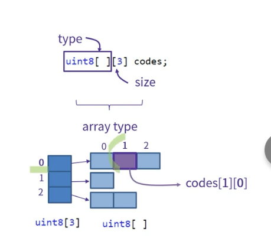
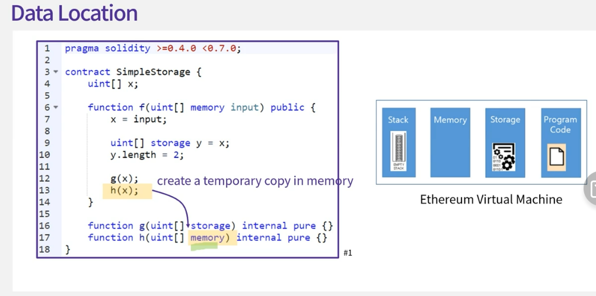
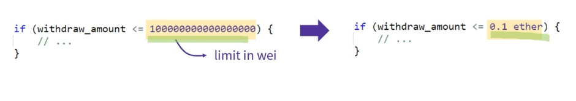
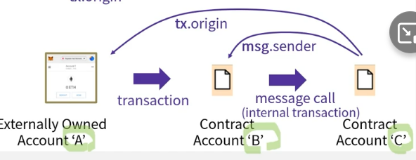

## 5.1 Introduction to Solidity

[링크](https://docs.soliditylang.org/en/v0.8.12/)
Solidity is an object-oriented, high-level language for implementing smart contracts. Smart contracts are programs which govern the behaviour of accounts within the Ethereum state.

Solidity is a curly-bracket language. It is influenced by C++, Python and JavaScript, and is designed to target the Ethereum Virtual Machine (EVM)

Solidity is statically typed, supports inheritance, libraries and complex user-defined types among other features.

```sol
pragma solidity >=0.4.0 <0.6.0;

import filename;
import * as name from filename;
import filename from name;
import { name } from filename;
import github.com/ethereum/sample.sol as sample // remix의 경우 github.com를 자동으로 mapping해주기 때문에 github 접근 가능

/// @title 문서화를 도와주는 NatSpec 기능
/** @title 멀티라인은 \/**로 시작하면 된다. **/
// contract는 storage영역에 저장되고
// 함수의 파라메터는 memory영역에 저장된다.
contract SimpleStorage {
    /** @dev ...
    *   @param w width of the rectangle
    *   @param h height of the rectangle
    *   @return a ...
    *   @return b ...
    */
    // Single-line
    /* Multi-line*/
    uint storedData;

    function set(uint x) public {
        storedData = x;
    }

    function get() public view returns (uint) {
        return storedData;
    }
}
```

- pragma는 solidity 0.4.0 버전을 기반으로 작성되었다는 것을 뜻하면 이후 버전 0.0.6 버전 직전까지에서도 정상 동작할 수 있게 한다. 이 줄을 통해 컨트랙트의 동작이 다를수 있는 환경에서 컴파일이 되지 않도록 보장한다. [^]0.[major].[minor]과 같은 형태가 되며 caret(^)은 해당 메이저 버전의 최신 버전까지 지원한다는 의미이다.

- pragma의 두번째 용도는 programming language의 특정 기능을 사용할 때이다. `pragma experimental ABIEncoderV2` <= 새로운 ABI encode를 활성화

- 다음의 storedData는 데이터베이스에서 함수를 호출함으로써 값을조회하거나 변경할 수 있는 하나의 영역이다. `this.` 키워드를 사용하지 않는다., state variable이라고 부른다.

- set함수를 호출하여 기존 값을 다른 값으로 덮어쓰는 것이 가능하지만 이전 숫자는 블록체인 히스토리 안에 여전히 저장된다. 참고로 블록체인은 블록을 삭제하더라도 블록체인에 계속 남아있다.

- State Variables
  - Values are permanently stored in contract storage
  - Visible
  - internal(by default): variable을 선언한 contract와 이 contract로부터 상속받은 contract에서만 접근 가능하다.
  - private: 오직 이 variable이 속한 contract만 접근, 단 접근 권한의 차이일뿐 블록체인에 공개됨
  - public: 어떤 외부에서도 접근가능, 특별히 solidity에서는 getter 메소드도 함께 생성됨
  - constant: js와 같음

## 5.2. Value Types

- Boolean
- !, &&, ||, ==, !=
- Integers
  - signed(8bit 단위로 존재)
    - int8(-128 ~ 127)
    - int16
  - unsigned(8bit 단위로 존재)
    - uint16(0 to 65,535)
    - uint(0 to 2^256-1)
- fixed, ufixed
  - 고정 소수점 타입으로 아직은 완벽하게 지원되지 않는다.
- Address: 주소값 저장시 사용
  - 20byte(이더리움 address 크기)를 담을 수 있다.
  - `address myaddr = 0x7342343eer3r3r234`
  - address.transfer(amount), address.send(amount)와 같은 함수를 제공하며 다른 address로 ether를 wei 단위로 보낸다.
  - address.balance라는 속성을 사용하여 address의 잔고를 조회가능하다
- Byte: Fixed-size byte arrays
  - bytes1 ~ 32까지 제공
  - `bytes1 data1 = 0xff`, 또는 byte로 대체가능(bytes1 == byte)
  - `bytes2 data2 = 0xffff`
  - 10진수 값으로 설정할 수 없다, 다만 0은 어떤 타입이든지 가능
- Enumerations
- 주의: enum type은 contract 밖에서는 created, locked 같은 이름을 사용할 수 없고 정수 값으로 사용해야 한다(??) 왜냐하면 Enum 값이 application binary interface로 컴파일 되지 않기 때문임.

```
enum State {
    Created = 0,
    Locked,Inactive = 1
}
```

## 5.3 Reference Types

- Array
  - Fixed arrays
    - uint8[5] codes = [1, 1, 2, 3, 5];
  - Dynamic arrays
    - 실행중에 크기가 결정됨
    - uint8[] codes;
    - 주의할 것은 인덱스 넣는 순서가 반대
    - 예를 들어 2차원 배열 만들 때 다음과 같이 만든다면 0번째의 1번째에 접근하려면 codes[0][1]이 아닌 codes[1][0]으로 접근해야함
    - 
    - 
    - 기본적으로 변수는 storage에 저장되고 파라메터 값은 memory에 지정되지만 이미지와 같이 명시적으로 지정할 수 있다.
    - 지정하지 않으면 기본값으로 storage에 저장된다.
    - memory, storage 서로 저장되는 곳이 다르다면 상대방의 데이터를 저장하고자 하는 데이터로 복사해서 옮겨서 가져온다. 예: 사진에서 x = input 일 때 input의 memory에 있는 값을 storage에 복사 한 후 x는 storage에 복사된 input을 가리킨다.
- String

  - Array의 다른 형태
  - 하지만 index, length 같은 기능 지원되지 않음
  - 그렇다면 string을 array로 변환해야하는데 내장 함수 없고 함수 직접 구현, 작업량이 많아지면 gas가 많이 들기 때문에 javascript단에서 작업 수행 권장

- Struct
  - 서로 다른 타입을 묶어서 새로운 타입 생성 typescript의 interface 와 비슷
- Mappings

  - key-value pair을 저장하는 해시 테이블
  - 키는 실제로 저장되지 않고 키의 해시 값이 저장되고 나머지 기능은 다른 것과 비슷
  - function의 parameter나 return type으로 사용할 수 없다.

  ```
      mapping (int => string) myMap;

      myMap[0] = 'test';

      mapping (string => mapping (address => uint )) myMap2;

      myMap2['test'][msg.sender] = newMap
  ```

## 5.4. Units and Globally Available Variables

- units
  - Time
    - seconds, minutes, hours, weeks, days
    - 내부적으로는 기본단위인 초로 변환되어 저장됨
    ```js
      function f(uint start) public {
        if (now >= start + 3 days) {
          //...
        }
      }
    ```
  - Ether
    - wei, szabo, finney, ether
    - 아래사진에서 내부적으로 wei로 바꿔서 계산하게 됨
    - 
- global variables
  - js의 window와 같은 것들
  - Transaction/Message Call Context
    - contract는 externally owned account하거나 다른 contract가 message call을 하면 실행되는데, 이때 contract에게 전달된 메시지 정보를 msg object를 통해서 읽을 수 있다.
    - msg
    - msg.sender, .value, .data. sig
  - Transaction Context
    - transaction과 관련된 정보를 제공한다.
    - tx
    - tx.gasprice
      - 현재 transaction의 gas price를 알려준다.
    - tx.origin
      - 현재 transaction의 시작 externally owned account의 address를 알려준다.
      - 예를 들어 A => B => C를 호출했을 때 C에서 tx.origin 값을 보면 A의 address를 알려준다.
      - 
  - Block Context
    - block과 관련된 정보를 제공
    - block.coinbase
      - 현재 블록을 채굴한 account의 주소를 제공
    - block.difficulty
      - 현재 블록 작업 증명의 어려운 정도를 제공
    - block.gaslimit
      - gas limit
    - block.number
      - 블록 넘버
    - block.timestamp
      - 채굴 시 기록된 시간 정보
  - Address Object
    - address.balance
      - address의 잔고 표시
    - address.transfer, .sender
      - 해당 address로 이더 전송
    - address.call, callcode, delegatecall
      - payload를 갖고 다른 contract를 부르는 저 수준의 메소드

## 5.5. Control Structures

- if
  - switch 없음
- while/for/do...while
- break/continue
- return
  - 함수에 리턴 타입을 지정한다.
  ```js
    function f() public returns (uint) {
      uint x = 10;
      return x;
    }
  ```
  - 아래와 같이 return 변수를 지정하여 return 할 수 있다.
  ```js
    function f() public returns (uint result) {
      unit x = 10;
      result = x;
    }
  ```

## 5.6. Functions
