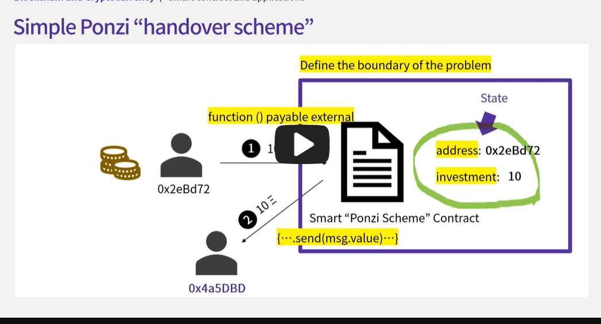
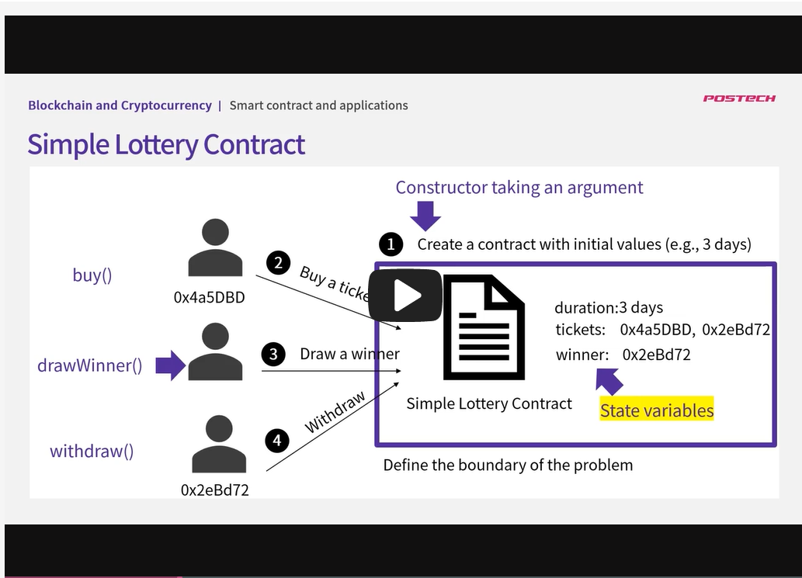
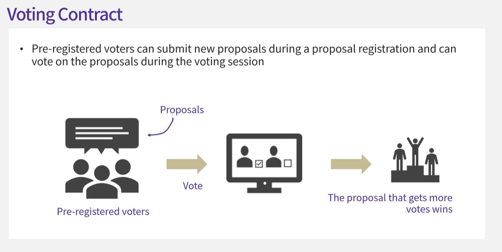
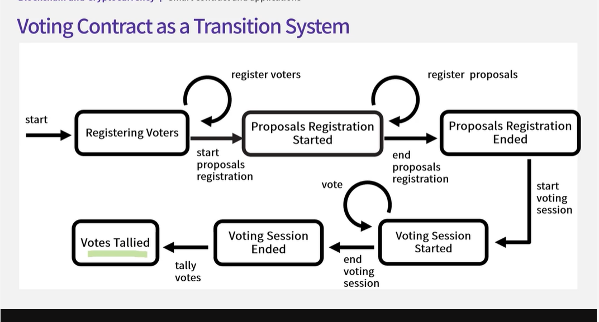

## 6.1 Programming with Solidity

```
pragma solidity ^0.4.24;


// Inheritance 적용전 contract
// contract Faucet {
//     address owner;

//     constructor() public {
//         owner = mag.sender
//     }

//     // 조건 검사 함수
//     modifier onlyOwner {
//         require(msg.sender == owner);
//         _; // 함수가 위치할 자리
//     }
//     // modifer 적용전
//     // function destroy() public {
//     //     require(msg.sender == owner);
//     //     selfdestruct(owner)
//     // }
//     // modifer 적용후
//     function destroy() public onlyOwner {
//         selfdestruct(owner)
//     }

//     // function <name> ([parameters])
//     // {public|private|internal|external}, 함수 공개 여부 default => public
//     // [pure|view|payable], 내부변수 쓰지도 읽지도 않음, 컨트렉의 내부 변수를 변경하거나 부르지 않음, 이더를 받을 수 있음
//     // [modifiers], 함수 기능 변화
//     // [returns (types)]
//     function withdraw(uint withdraw_amount) public {
//         // 인출 제한, 0.1 이더보다 작아야한다., false값일 때 에러 반환
//         require(withdraw_amount <= 0.1 ether); // 0.1 ether == 1*10^12, (wei, szabo, ether)
//         // 요청한 곳에 이더 전송
//         msg.sender.transfer(withdraw_amount);
//     }


//     // 이 contract를 호출한 transaction이 아무런 함수를 지정하지 않았을 경우 실행
//     // 0.5에서는 function() external payable {} 내부에서 안부르고 외부에서 부르므로
//     // 0.6에서는 fallback() external payable{}
//     // receive() external payable {} //함수 이름 지정 없이 이더를 받을 경우 receive 호출
//     function () public payable {}
// }


import "./Mortal.sol";
contract Faucet is Mortal {
    // function <name> ([parameters])
    // {public|private|internal|external}, 함수 공개 여부 default => public
    // [pure|view|payable], 내부변수 쓰지도 읽지도 않음, 컨트렉의 내부 변수를 변경하거나 부르지 않음, 이더를 받을 수 있음
    // [modifiers], 함수 기능 변화
    // [returns (types)]
    function withdraw(uint withdraw_amount) public {
        // 인출 제한, 0.1 이더보다 작아야한다., false값일 때 에러 반환
        require(withdraw_amount <= 0.1 ether); // 0.1 ether == 1*10^12, (wei, szabo, ether)
        // 요청한 곳에 이더 전송
        msg.sender.transfer(withdraw_amount);
        emit Withdrawal(msg.sender, withdraw_amount);
    }


    // 이 contract를 호출한 transaction이 아무런 함수를 지정하지 않았을 경우 실행
    // 0.5에서는 function() external payable {} 내부에서 안부르고 외부에서 부르므로
    // 0.6에서는 fallback() external payable{}
    // receive() external payable {} //함수 이름 지정 없이 이더를 받을 경우 receive 호출
    function() public payable {
        emit Deposit(msg.sender, msg.value);
    }

    // 로그 기록
    event Withdrawal(address indexed to, uint amount);
    event Deposit(address indexed from, uint amount);
}
```

```
pragma solidity ^0.4.24;

contract Owned {
    address owner;

    constructor() public {
        owner = msg.sender;
    }

    modifier onlyOwner {
        require(msg.sender == owner);
        _;
    }
}
```

```
pragma solidity ^0.4.24;

import "./Owned.sol";

contract Mortal is Owned {
    function destroy() public onlyOwner {
        selfdestruct(owner);
    }
}
```

## 6.2 Ponzi Contract

폰지 스킴은 투자 사기 수법중 하나, 실제 아무런 이윤 창출 없이 투자자들이 투자한 돈을 이용해 투자자들에게 수익을 지급하는 방식.

블록체인과 스마트 컨트랙트의 특성이 폰지 스킴을 작성하기에 유리한 환경

1. 익명성

- 폰지 스킴 컨트랙트를 배포한 사람이 누구인지 알기 어렵다.

2. 스마트 컨트랙트는 한번 배포되면 일반적으로 멈추거나 피해자를 위해서 transaction을 되돌리기가 매우 어렵다.

3. 블록체인의 모든 transaction이 공개되있어 한번 기록되면 변경 불가하기 때문에 사람들이 공정한 거래를 한다는 잘못된 믿을을 갇게되는 심리 역이용

간단하게 받은 코인을 지급하는 컨트랙트 구현 예제

1. 첫 번째 투자자가 와서 10이더를 스마트 컨트랙트에 보내면
2. 스마트 컨트랙트는 받은 이더가 현재 자신이 기록한 숫자보다 10%가 더 많으면, 받은 이더를 자신이 기억하고 있는 주소로 보낸다.
3. 그리고 주소를 새로운 투자자의 주소로 변경하고, 받은 금액을 investment에 기록한다.

- 

```
pragma solidity >=0.7.0 <0.9.0;

/**
 * @title Storage
 * @dev Store & retrieve value in a variable
 * @custom:dev-run-script ./scripts/deploy_with_ethers.ts
 */
contract SimplePonzi {
    address payable public currentInvestor;
    // 전 금액
    uint public currentInvestment = 0;

    // 화폐접근 가능, 외부 컨트랙트에 공개 함수
    // 컨트랙트가 아무런 함수 지정없이 호출되면 이 함수 실행
    // receive:  순수하게 이더만  받을때 작동 합니다.
    // fallback: 함수를 실행하면서 이더를 보낼때, 불려진 함수가 없을 때 작동합니다.
    fallback() external payable {
        // 투자금에 1.1 곱하기
        uint minimumInvestment = currentInvestment * 11/10;
        require(msg.value > minimumInvestment);

        address payable previouseInvestor = currentInvestor;
        currentInvestor = payable(msg.sender);
        currentInvestment = msg.value;

        // 이전 투자자에게 현재 투자자에게 받은 이더를 보낸댜.
        previouseInvestor.send(msg.value);
    }
}
```

## 6.3 Lottery Contract

- 블록체인은 그 투명성 때문에 복권 개발에 좋은 구조

1. 복권 진행 기간 설정
2. 유저가 복권을 사면 address를 저장한다.
3. 정해진 시간이 지나면 당첨자를 뽑는다.
4. 기록된 address중에 랜덤으로 하나를 뽑는다.(모든 블록에서 같은 값을 제공하는 랜덤 값을 써야한다., 또한 블록체인 특성상 랜덤 함수 라이브러리 제공 없음)
5. winner에게 당첨금을 지불한다.

- 1번은 컨트랙트의 constructor로 duration을 받고 contract를 생성
- 나머지 3개는 contract의 메소드로 구현한다.
- 

아래 코드는 block hash때문에 web remix에서 web3 injected로 배포해야된다.

```
pragma solidity >= 0.4.0 < 0.7.0;

contract SimpleLottery {
    uint ticketingClosesAt;
    address[] public tickets;
    address public winner;


    constructor(uint duration) public {
        // now: 현재 블록 타임스탬프
        ticketingClosesAt = now + duration * 1 days;

    }

    function buy() public payable {
        // 금액확인
        require(msg.value >= 0.001 ether);
        // 복권 시간 확인
        require(now < ticketingClosesAt);

        tickets.push(msg.sender);
    }

    fallback() external payable {
        buy();
    }

    receive() external payable {}

    function drawWinner() public {
        // NOTE: require(false) 일 때 에러 발생

        // 종료시간 이후 5분이 지났는지 확인
        // 게임에 참여하는 동안에는 당첨자를 찾는데 사용할 block number를 알 수 없도록 하기 위해서
        require(now > ticketingClosesAt + 5 minutes);
        // winner가 할당되지 않았는지 확인
        // NOTE: address 초기값 0x00으로 할당됨
        require(winner == address(0));

        // 이제 랜덤 넘버를 구한다.
        // 현재 블록의 hash 값을 알수 없기 때문에 이전 블록의 해쉬값을 구함(?)
        bytes32 hash = blockhash(block.number - 1);
        bytes32 rand = keccak256(abi.encode(hash));

        // hash값을 정수로 변환한뒤에 당첨자를 구한다.
        winner = tickets[uint(rand) % tickets.length];
    }

    function withdraw() public {
        // 당첨자에게 보내는 것인지 확인
        require(msg.sender == winner);
        // 모든 이더를 보낸다
        msg.sender.transfer(address(this).balance);

    }
}
```

- **위 코드의 랜덤 넘버를 구하는 로직에 이슈가 있다.**

  - 블록을 생성하는 채굴업자들이 자신들에게 유리한 방향으로 블록 해시 값을 조정할 가능성이 있기 때문에.
  - 예를 들어서, 생성된 블록 번호가 자신에게 유리하지 않는다면 이를 채택하지 않고 다시 새로운 블록을 만들면서 자신의 당첨 확률을 높일 수도 있다.

- 새로운 방법은 게임 참여자들에게 각자 랜덤 숫자를 제출하도록 하고 이들을 전부 합친 값의 hash 값을 random number로 사용하는 방식으로 한다.
  - 하지만 참여자들이 제출한 랜덤 숫자가 모두 블록체인상에 공개되기 때문에 당첨 번호를 알 수있다는 단점이 있다.
  - 그렇기 대문에 자신의 랜덤 숫자를 감추어서 제출하고 나중에 공개하는 방식을 사용한다.
  - 이러한 방식을 commit-reveal 방식이라고 한다.

1. contract가 배포될 때 복권 기간 뿐만아니라 random 숫자를 공개하는 기간을 설정할 수 있도록 한다.
2. 주어진 기간 동안 복권을 산다. 이 때에 구매자는 랜덤 숫자의 hash 값을 제출한다. 이를 commitment hash라고 부르겠다. commitment hash는 자신의 address와 랜덤 숫자를 합친 값의 hash이다.
3. 티켓팅 기간이 끝나면.참여자들은 자신의 random number를 공개한다.
4. contract는 사용자가 밝힌 random number와 사용자의 주소를 이용해 hash 값을 만든다.
5. 이 hash 값이 자신이 기록하고 있는 값과 같은지를 확인한다.
6. 같다면 사용자의 random number를 seed에 추가한다. 그리고 사용자의 address를 최종 게임 참여자의 리스트에 추가한다.
7. 이제 당첨자를 뽑는다. 앞 단계에서 주어진 seed 값을 바탕으로 최종 참여자 address 중에서 하나를 뽑고 당첨자로 선정하고 이더를 보낸다.

```
pragma solidity >=0.4.0 < 0.7.0;

contract CommitRevealLottery {
    uint public ticketingCloseAt;
    uint public revealingCloseAt;

    address[] public tickets;
    address public winner;
    bytes32 seed;
    // key, value
    mapping (address => bytes32) public commitments;

    constructor(uint duration, uint revealDuration) public {
        ticketingCloseAt = now + duration * 1 days;
        // 왜 공개일도 따로 둬야되지?
        revealingCloseAt = ticketingCloseAt + revealDuration * 1 days;
    }

    // commitments: 구입시 숫자 입력 + address 더한 hash값
    function buy(bytes32 commitment) public payable {
        require(msg.value >= 0.001 ether);
        require(now < ticketingCloseAt);

        commitments[msg.sender] = commitment;
    }

    // player address + 랜덤 숫자
    function createCommitment(address player, uint rand) public pure returns (bytes32) {
        return keccak256(abi.encode(player, rand));
    }

    // 왜 또 rand를 넣어야하지?? => commitments[msg.sender]하면 되는것 아닌가??
    // 사용자들은 random 숫자를 공개하고 seed 값을 업데이트한다.
    function reveal(uint rand) public {
        require(now >= ticketingCloseAt);
        // 구입했지만 공개일에 열리지 않은 블록은 버린다??
        require(now < revealingCloseAt);

        bytes32 hash = createCommitment(msg.sender, rand);
        // 사용자가 밝힌 rand 값을 이용해서 commitment hash를 만들고 이 값이 앞에서 사용자가 제출했던 commitment
        // hash 값과 동일한 지를 확인한다.
        require(hash == commitments[msg.sender]);

        seed = keccak256(abi.encode(seed, rand)); // seed 값을 계속 업데이트하여 랜덤성을 부여한다.
        tickets.push(msg.sender);
    }

    // 당첨자를 구한다.
    function drawWinner() public {
        require(now > revealingCloseAt + 5 minutes);
        require(winner == address(0));

        winner = tickets[uint(seed) % tickets.length];
    }

    // 당첨자에게 돈 보내기
    function withdraw() public {
        // 보낼사람이 winnder인지 확인
        require(msg.sender == winner);

        // this = contract의 인스턴스(여러 블록이 있지만 컨트랙트는 하나)
        // address(this) = contract의 주소
        msg.sender.transfer(address(this).balance);
    }
}
```

## 6.4 Vote Contracts

- 선거 운영 주체를 믿을 수 있나? or 외부의 공격 => 탈중앙화된 투표시스템

- 
- 우리가 만들 시스템 간단히 설명하면

1. 유권자가 있고
2. 이들을 등록하는 기능이 있어야 한다.
3. 이들이 새로운 정책을 제안한다.
4. 투표가 시작되면 각 유권자들은 자신이 지지하는 정책에 투표를 하게 된다.
5. 투표가 끝나면 가장 많은 표를 얻은 정책이 채택된다.

- 

상태도에 따라 코딩 결과

```
pragma solidity >= 0.4.0 < 0.7.0;

// 선거 상태
enum WorkflowStatus {
    RegisteringVoters,
    ProposalsRegistrationStarted,
    ProposalsRegistrationEnded,
    VotingSessionStarted,
    VotingSessionEnded,
    VotesTallied
}

contract SimpleVote {
    // Registering Voters는 RegisteringVoters 상태에서만 가능하다.
    WorkflowStatus public workflowStatus = WorkflowStatus.RegisteringVoters;
    uint winningProposalId;

    modifier onlyDuringVotersRegistration() {
        require(workflowStatus == WorkflowStatus.RegisteringVoters, "This function can be called only before proposals registration has started");
        _;
    }

    modifier onlyDuringProposalsRegistration() {
        require(workflowStatus == WorkflowStatus.ProposalsRegistrationStarted, "This function can be called only during proposals registration");
        _;
    }

    modifier onlyAfterProposalsRegistration() {
        require(workflowStatus == WorkflowStatus.ProposalsRegistrationEnded, "This function can be called only after proposals registration");
        _;
    }

    modifier onlyDuringVotingSession() {
        require(workflowStatus == WorkflowStatus.VotingSessionStarted, "This function can be called only during the voting session");
        _;
    }

    modifier onlyAfterVotingSession() {
        require(workflowStatus == WorkflowStatus.VotingSessionEnded, "This function can be called only after the voting session has ended");
        _;
    }

    modifier onlyAfterVotesTallied() {
        require(workflowStatus == WorkflowStatus.VotesTallied, "This function can be called only after votes have been tallied");
        _;
    }

    address public administrator;
    modifier onlyAdministrator() {
        require(msg.sender == administrator, "The caller of this function must be the administrator");
        _;
    }

    struct Voter {
        bool isRegistered;
        bool hasVoted;
        uint votedProposalId;
    }
    mapping(address => Voter) public voters;
    modifier onlyRegisterdVoter() {
        require(voters[msg.sender].isRegistered, "The caller of this function must be a registered voter");
        _;
    }

    // 상태변경
    function startProposalsRegistration() public onlyAdministrator onlyDuringVotersRegistration {
        workflowStatus = WorkflowStatus.ProposalsRegistrationStarted;
    }

    function startVotingSession() public onlyAdministrator onlyAfterProposalsRegistration {
        workflowStatus = WorkflowStatus.VotingSessionStarted;
    }

    function endVotingSession() public onlyAdministrator onlyDuringVotingSession {
        workflowStatus = WorkflowStatus.VotingSessionEnded;
    }

    function registerVoter(address _voterAddress) public onlyAdministrator onlyDuringVotersRegistration {
        require(!voters[_voterAddress].isRegistered, "The voter is already registered");
        voters[_voterAddress].isRegistered = true;
        voters[_voterAddress].hasVoted = false;
        voters[_voterAddress].votedProposalId = 0;
    }

    struct Proposal {
        string description;
        uint voteCount;
    }

    Proposal[] public proposals;
    function registerProposal(string memory proposalDescription) public onlyRegisterdVoter onlyDuringProposalsRegistration {
        proposals.push(Proposal({
            description: proposalDescription,
            voteCount: 0
        }));
    }

    function vote(uint proposalId) public onlyRegisterdVoter onlyDuringVotingSession {
        // 중복투표 막기
        require(!voters[msg.sender].hasVoted, "The caller has already voted");

        voters[msg.sender].hasVoted = true;
        voters[msg.sender].votedProposalId = proposalId;

        proposals[proposalId].voteCount += 1;
    }

    // 투표가 끝났는지 확인
    function tallyVotes() public onlyAdministrator onlyAfterVotingSession {
        uint winningVoteCount = 0;
        uint winningProposalIndex = 0;

        for (uint i =0; i<proposals.length; i++) {
            if (proposals[i].voteCount > winningVoteCount) {
                winningVoteCount = proposals[i].voteCount;
                winningProposalIndex = i;
            }
        }

        winningProposalId = winningProposalIndex;
        workflowStatus = WorkflowStatus.VotesTallied;
    }

    constructor() public {
        administrator = msg.sender;
    }
}
```
