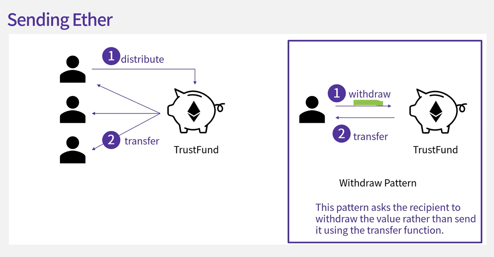

## 7.1 Security Challenges

블록체인은 버그 하나도 치명적일 수 있다. 실제로 2016년 DAO 해킹에서는 500억 원이 넘는 돈이 위험에 처하기도 했다.

2010년 8월 비트코인 개발자인 Jeff Garzik은 블록의 value out이 이상하다는 짧은 글을 올렸다.

- 

1. 그는 한 블록이 총 92 빌리언 비트코인을 갖고 있음을 발견했다. 그 당시에 거래되는 비트코인의 총 액수가 3백만 비트코인 밖에 없었던 것을 보면 명백히 잘못된 값이다.

이는 integer overflow 버그 때문에 생긴 것인데 두 정수값의 합이 마이너스가 되는 것을 확인하지 않고 그 결과를 unsigned integer로 취급하니 엄청나게 큰 값이 되어버린 것이다.

비트코인 네트워크는 버그 수정 후에 이전 transaction으로 되돌릴 수 밖에 없었다.

2. 또한 시스템의 업그레이드 때문에 문제가 발생하기도 했다.

2012년 비트코인 core 버전이 0.7에서 0.8로 업그레이드 되었는데 새로운 버전이 이전 버전과 호환되지 않는 문제가 생겨 이전 버전에서 생성되는 블록들이 새로운 버전에는 인식되지 않는 문제가 생겼고 비트코인 네트워크에 두 가지 버전의 비트코인이 생겨나기 시작했다.

결국 비트코인 커뮤니티는 모두가 이전 버전으로 되돌아가기로 결정했고 새로운 버전에서 생성된 블록들은 포기하게 됐다.

새로운 버전에서 채굴에 성공했던 채굴업자들은 손해를 감수하고 이전 버전으로 되돌아가는 것에 동의하면서 문제가 해결됐다.

3. 스마트 컨트랙트의 안전성 문제
   코어 시스템의 경우에는 상대적으로 철저하게 리뷰되고 테스트 되고 있으며 심각한 경우에는 이전 버전으로 되돌리는 방법으로 문제를 해결할 수 있지만, 스마트 컨트랙트는 그렇지 못하다는 문제가 있다.

4. The DAO Hack (2016)
   전통적인 관리조직이나 이사회가 존재하지 않는 투자 신탁.

펀드를 받고자 하는 프로젝트는 proposal을 내게 되는데 프로젝트의 방향성이 변경되거나 새로운 아이디어가 제시되면 이 제안에 반대하는 사람은 그냥 기존 proposal에 남아있고, 찬성하는 사람의 fund만 새로운 주소로 옮겨간다는 구성이다.

이는 다수결의 횡포를 막기 위해서 만들어졌다.
문제는 새로운 주소로 옮겨갈 때 fund를 먼저 보내고 나서 값을 초기화하고 있는데 여기서 만약 문제가 생기면
돈만 보내고 값은 그대로 남는 경우가 발생할 수 있다.

- 

해커들은 앞에서 설명한 버그를 이용한 공격을 시작하였고 500억원이 다른 계정으로 옮겨지는 상황이 발생했다.

이로 인한 피해를 보상하기 위해 이더리움에서는 하드 포크를 통해 투자자의 토큰을 되돌려 주기로 결정한다.
하지만 하드 포크를 반대하는 사람들로 인해 기존 블록체인을 계속 유지하기로 하였고 이더리움은 이더리움 클래식과 이더리움으로 나뉘게 된다.

5. Ethereum Name Service Bug (2017)
   인터넷상의 DNS 서비스와 같이 이더리움의 account address를 쉬운 표기법으로 사용할 수 있게 해주는 서비스이다.

경매 방식을 사용하여 원하는 이름을 사용할 수 있다.

그런데, 2017년 이 서비스가 처음 공개됐을 때 경매가 끝나고 경매에 참여할 수 있는 버그가 발견됐다.

- 

수정전 코드(왼쪽)에서는 경매 기간이 끝났는지를 확인하는 부분이 빠져있었다.

그러나 수정 후의 코드도 문제가 있었는데 \_value, value가 혼동되어 사용되고 있었던 것이다.

- 

6. The Parity wallet exploits
   멀티 시그니쳐를 지원하는 전자 지갑에 버그가 발생했다.

- 
  WalletLibrary의 initWallet은 여러 명의 owner 어드레스를 넘겨 받아서 이 값을 wallet의 주인으로 설정하게 된다.

Wallet에는 fallback 메소드가 있다. 여기에서는 msg.data.length > 0일 때 walletLibrary의 initWallet을 호출하게 된다.

만약 처음에 불린 메소드가 initWallet이라면 Wallet contract에서는 fallback 메소드를 호출하게 되고 다시 delegatecall을 호출하게 되면 initWallet이 호출이 되게 되어서 지갑의 주인을 바꿀 수가 있게 된다.

- 

코드의 이런 문제점은 사진과 같이 초기화가 된 경우에는 다시 초기화 될 수 없도록 조건이 추가되었고 initWallet이 외부에서 호출되지 않도록 internal 키워드를 붙여서 해결하게 됐다.

하지만 이미 위험에 노출된 수많은 wallet 스마트 컨트랙트는 어떻게 됐을까?

해커가 이 버그를 이용해서 이더를 훔쳐간 것과 동일한 방법으로 사용자들의 이더를 안전한 새로운 계정으로 옮겨주었다.

하지만 몇 개월 후 다른 버그 때문에 이 라이브러리를 사용하던 151개의 어드레스가 영향을 받아 이들의 $152 밀리언 달러가 잠겨버리는 일이 발생됐다.한 사용자가 initWallet을 실행시켜서 wallet library의 owner가 되었고 별생각없이 suicide/selfdestruct 명령을 보냈다고 한다.

## 7.2 Contract Security

- 이더브리움/블록체인에 저장되는 모든 데이터는 모두 공개되어있다고 봐야한다.
- 예를 들어 public, private는 다른 컨트랙트에서 읽을 수 있는지 없는지의 차이이지 블록체인 상에서 비공개라는 의미는 아니다.
- 컨트렉트의 주소를 통해서 읽을 수 있다. (이더리움에서 문자열을 UTF-8로 저장)

1. Sending Ether의 메소드에 의해서 발생하는 이슈
   address.transfer(value) // throw an error if the transfer fails, 가장 안전한 방법
   address.send(value) // return false if the transfer fails, 실패해도 계속 진행
   address.call.value(value)() // gas를 지정하지 않으면 모두 보내기 때문에 위험

```
contract Fauccet {
   function withdraw(uint withdraw_amount) public {
      require(withdraw_amount <= 100000000000000);

      msg.sender.transfer(withdraw_amount);
   }

   function () public payable {}
}
```

위의 예제에서 받는 쪽의 address가 contract 어드레스라면 해당 contract의 fallback function을 부르게 된다.

예를 들어서 faucet contract으로 이더를 보낸다면 faucet contract의 fallback 메소드가 불리게 된다.

만약에 contract에 fallback 메소드가 없거나 fallback method가 payable이 아니라면 이에 지불하는 transfer 메소드는

error exception을 내고 해당 메소드는 rollback되게 된다.

이것이 악용될 수 있는데 바로 여러 개의 계좌에 이더를 지불하는 로직이 있을 때 어떤 계좌에도 이더가 안들어가게 하는 방법이다. 아래와 같은 이더를 분배하는 컨트랙트가 있다고 가정한다.

```
pragma solidity ^0.4.22;

contract TrustFund {
    address[3] partners;

    // deploy시에 사용될 컨스트럭터
    // 1.
    // 가장 마지막 주소의 계좌에서 수수료가 빠져나간다.(?)
    // ["0x5B38Da6a701c568545dCfcB03FcB875f56beddC4", "0xAb8483F64d9C6d1EcF9b849Ae677dD3315835cb2", "0x4B20993Bc481177ec7E8f571ceCaE8A9e22C02db"]
    constructor(address[3] _partners) public {
        partners = _partners;
    }

    function updateAddress(uint partner, address newAddress) public {
        require(msg.sender == partners[partner]);
        partners[partner] = newAddress;
    }

    // 3. distribute버튼을 눌러 보낸 이더를 분배한다.
    function distribute() public {
        uint balance = address(this).balance; // 현재 컨트렉트의 balance;
        partners[0].transfer(balance/2);
        partners[1].transfer(balance/4);
        partners[2].transfer(balance/4);
    }

    // 2.
    // fallback을 통해서 이더를 전송할 수 있다.
    // 20이더를 전송한다.
    function () public payable {}
}
```

만약 이러한 분배에 불만을가진 한 사람이 다음과 같은 컨트랙을 만들었다고 가정한다.

```
pragma solidity ^0.4.22;

contract BadPartner {}
```

위의 컨택스트를 배포 한 후 updateAddress에 1, "0x9bF88fAe8CF8BaB76041c1db6467E7b37b977dD7"에 넣어서
자신의 주소를 "폴백"이 없는 컨텍스트의 주소로 수정한다.

그 후에 다시 distribute 버튼을 누르면 에러가 발생하고 자신의 어드레스가 포함된 분배는 모두 이더를 받지 못하게 된다.

이를 방지하기 위해서는...

transfer대신 실패해도 계속 진행되는 send 메소드를 사용한다., 단 send 메소드는 항상 return 값을 확인해야 하기 때문에 권장하는 방법은 아니다.

withdraw 패턴을 사용하여 해결 가능하다.(추가적으로 transfer 메소드 호출 수가 줄었기 때문에 gas도 절약가능)

- 

```
function withdraw(uint child) public {
   require(msg.sender == partners[child]);
   uint withdrawnSoFar = withdrawn[child];
   uint allocation = totalFunding / distribution[child];

   require(allocation > withdrawnSoFar);
   uint amount = allocation - withdrawnSoFar;
   withdrawn[child] = allocation;
   msg.sender.transfer(amount);
}
```
