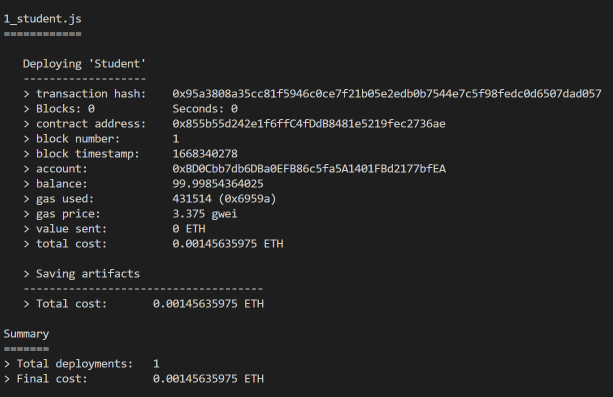

## Decentralized Applications(DApps)

존스턴의 정의

1. 오픈소스로 운영되어야 하고 자율적으로 운영되며 토큰의 과반 이상을 지배하는 세력이 없어야 한다.

2. 토큰을 생성해야 한다.

3. 마켓의 상황이나 개선 등의 이유로 프로토콜 변경시 반드시 다수결의 합의를 통해서 결정되어야 한다.

## Decentralized Autonomous Corporation(탈중앙화된 자율기업)

비트코인을 소프트웨어가 아닌 화폐라는 관점을 보게 되면 화폐주조에 독점권을 갖는 정부와 대립할 수밖에 없다. 이런 문제를 해결하기 위해서 비트코인을 화폐가 아닌 배당으로 보려고 했던 것이 DAC이다.

화폐로서의 비트코인은 소유하고 있다고 이익이 나지 않지만,
DAC의 비트코인은 소유하고 있으면 이 지분에 대한 배당금을 받을 수 있다.

이러한 생각은 비슷한 시기에 비탈릭에 의해서 Decentralized Autonomous Organization이라고 불리면서 주목을 받는다.

간단히 Decentralized Application 또는 Computer program이라 부른다.

비트코인 블록체인 회사와 같은 기업집단으로 해석한다.

비트코인을 소유한 사람들은 주주이면서 동시에 이 기업을 홍보하는 마케팅을 담당하고 있으며, 비트코인 네트워크는 비트코인 채굴업자들을 고용해서 이들에게 새로 찍어낸 비트코인을 임금으로 주며 자율적으로 운영되고 있다는 것이다.

존스턴은 DApp을 세 가지 유형으로 나눴다.

- 
  Type 1: 비트코인처럼 자신의 블록체인이 있는 경우
  Type 2: 마스터코인의 예처럼 자신의 프로토콜은 있지만, Type 1 application의 블록체인을 사용하는 경우
  Type 3: Type 2 어플리케이션을 이용해서 자신의 프로토콜을 개발하는 경우

예를 들면
Type 1 = 이더리움
Type 2 = 크립토키티
Type 3 = 크립터키티 프로토콜 위에서 새로운 protocol과 토큰을 만드는 서비스

존스턴의 DApp 개발 3단계

1. DApp을 설명하는 백서가 작성되어 DApp의 프로토콜, 특징, 구현 방식, 토큰 분배 방식 등을 공개적으로 소개한다.
2. 초기 토큰 분베
3. 다수에게 소유권 이전

토큰이 인센티브 역할을 해서 사용자들의 자발적 참여를 불러일으키고 활발히 거래되면서 지속가능한 어플리케이션 모델이 가능하다.

이런 DA의 특징 덕분에 탈중앙화가 가능한 모든 부분은 탈중앙화가 이루어질 것이라고 말을 했는데 이를 존스턴의 법칙이라고 부른다.

어떤 것이 탈중앙화가 가능할까?

1. 금융
2. 데이터 관리 (P2P 파일 쉐어링)

   자신의 디스크 공간을 제공하면 코인으로 보상한다.
   IPFS(Inter Planetary File System)
   Ethereum Swarm
   Filecoin

3. 사용자 신원 관리

   국가가 신원을 관리 소홀/전쟁 등으로 관리가 허술해지면 신분 인증이 제대로 되지 않음

   - 

4. 컴퓨팅

   자신의 컴퓨팅 자원을 빌려주고 토큰으로 보상받는다.
   Golem

## 8.2 Interaction with the Contracts

1. ethereum blockchain and smart contracts.
2. whisper protocol: to communicate p2p and broadcast.
3. swarm protocol: the decentralized file storage.

블록체인을 활용한 학생정보 관리 시스템(with web3.js, 가나쉬(개인용 블록체인))

- 

```solidity
pragma solidity >= 0.4.22 < 0.8.0;

contract Student {
    string firstName;
    string lastName;
    string dateOfBirth;

// memory: 프로그램이 동작될 때만 임시적으로 기억, storage가 default. storage는 모든 컨트렉트에 있는 영역
    function setStudent(string memory _firstName, string memory _lastName, string memory _dateOfBirth) public {
        firstName = _firstName;
        lastName = _lastName;
        dateOfBirth = _dateOfBirth;
    }

    function getStudent() public view returns (string memory, string memory, string memory) {
        return (firstName, lastName, dateOfBirth);
    }
}
```

## 8.3 Event Logging

```sol
pragma solidity >= 0.4.22 < 0.8.0;

contract Student {
    string firstName;
    string lastName;
    string dateOfBirth;

// memory: 프로그램이 동작될 때만 임시적으로 기억, storage가 default. storage는 모든 컨트렉트에 있는 영역
    function setStudent(string memory _firstName, string memory _lastName, string memory _dateOfBirth) public {
        firstName = _firstName;
        lastName = _lastName;
        dateOfBirth = _dateOfBirth;
        emit Added(msg.sender, _firstName, _lastName, _dateOfBirth);
    }

    function getStudent() public view returns (string memory, string memory, string memory) {
        return (firstName, lastName, dateOfBirth);
    }

     // event에서는 memory keyword가 안된다.
    event Added (address indexed f, string firstName, string lastName, string dateOfBirth);
}
```

## 8.4 truffle

프론트, solidity, ganache, 테스트 등 셋팅이 다 되어있는 프레임워크

migrations 파일 하위에 위하는 JS 파일은 1*, 2* ... n\_ 와 같은 형식이 되어야함

contract deploy는 truffle develop, migrate

- 

- 데이터를 컨트렉트에 적는 일 => transaction
- 컨트렉트를 변경하지 않고 일기만 (gas 소모 되지 않음) => call
